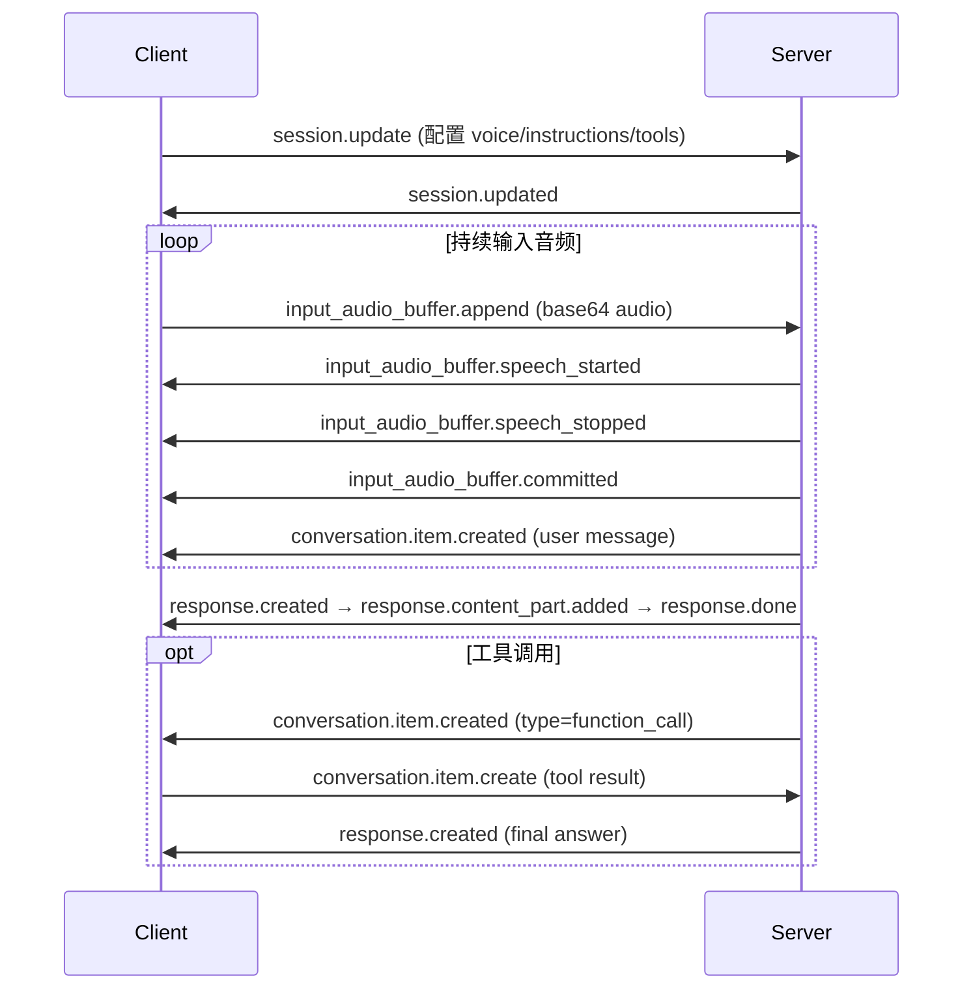

# omni realtime api

Qwen-Omni-Realtime API 是基于 WebSocket 的低延迟、多模态实时交互接口，支持语音输入/输出、文本生成、图像理解及工具调用等能力。它采用事件驱动模型，客户端通过发送标准化事件（如 `session.update`、`input_audio_buffer.append`）控制会话状态与数据流，服务端通过异步事件（如 `response.audio.delta`、`conversation.item.created`）实时推送响应片段。该 API 专为语音助手、智能客服、实时音视频交互等场景设计。

## 支持的模型/功能

- **核心模型系列**：  
  - `qwen3.5-omni-realtime`（支持 `semantic_vad`、联网搜索、完整工具调用）  
  - `qwen3.5-omni-plus-realtime` 与 `qwen3.5-omni-flash-realtime`（支持 `idle_timeout_ms`、声音复刻）  
  - `qwen3-omni-flash-realtime` 与 `qwen-omni-turbo-realtime`（轻量级，VAD 仅支持 `server_vad`）  
  > **注意**：文档中 `qwen-omni-turbo` 系列模型多次被标注为“不支持修改”多数参数（如 `temperature`、`top_p`、`max_tokens` 等），但 [客户端事件](../../raw/model-api-reference/omni-realtime-api/client-events.md) 中示例仍展示了对 `qwen-omni-turbo-realtime` 设置 `temperature: 1.0` 和 `top_p: 0.01`，此为矛盾信息；实际调用时应以 SDK 文档和运行时错误为准，避免在 `qwen-omni-turbo` 系列上设置受限参数。

- **多模态能力**：  
  - 输入：PCM 音频（16 kHz）、JPG/JPEG 图像（≤1080p，Base64 编码后 ≤256 KB）  
  - 输出：文本 + PCM 音频（24 kHz），可单独启用 `["text"]` 模态  
  - 实时转录：内置 `qwen3-asr-flash-realtime` 模型，支持情感识别（`emotion` 字段）与增量预览（`text` + `stash`）  

- **高级功能**：  
  - 语音活动检测（VAD）：`server_vad`（全系列）与 `semantic_vad`（仅 `qwen3.5-omni-realtime`）  
  - 工具调用（Function Calling）：定义 `tools` 后，模型自主触发并返回 `function_call` 类型对话项  
  - 联网搜索（`enable_search`）：仅 `qwen3.5-omni-realtime` 系列支持，与 `tools` 互斥  
  - 声音复刻：需先调用 `qwen-voice-enrollment` 创建音色，再于 `session.update` 中指定 `voice` 参数使用，详见 [声音复刻API参考](../../raw/model-api-reference/omni-realtime-api/qwen-omni-voice-cloning.md)  

## 关键参数

所有会话级参数均通过 `session.update` 事件或 SDK 的 `update_session()` 方法配置，以下为通用且高频使用的参数：

| 参数 | 类型 | 说明 | 默认值（按模型系列） |
|------|------|------|------------------------|
| `modalities` | `["text"]` \| `["text","audio"]` | 输出模态组合 | `["text","audio"]` |
| `voice` | `string` | 音色名称，支持标准音色或声音复刻 ID | `Tina` / `Cherry` / `Chelsie`（见 [客户端事件](../../raw/model-api-reference/omni-realtime-api/client-events.md)） |
| `input_audio_format` / `output_audio_format` | `"pcm"` | 固定值，输入为 16 kHz PCM，输出为 24 kHz PCM | — |
| `instructions` | `string` | 系统角色指令，影响模型行为边界 | — |
| `turn_detection.type` | `"server_vad"` \| `"semantic_vad"` | VAD 类型，`semantic_vad` 仅 `qwen3.5-omni-realtime` 支持 | `"server_vad"` |
| `turn_detection.threshold` | `float [-1.0, 1.0]` | VAD 灵敏度，嘈杂环境建议调高 | `0.5` |
| `turn_detection.silence_duration_ms` | `int [200, 6000]` | 语音结束静音阈值（ms） | `800` |
| `turn_detection_param.idle_timeout_ms` | `int [5000, 30000]` | 静默超时主动引导，仅 `qwen3.5-omni-plus/flash-realtime` + `server_vad` 生效 | — |
| `enable_search` | `boolean` | 启用联网搜索（仅 `qwen3.5-omni-realtime`） | `false` |
| `tools` | `array` | 工具定义列表，含 `name`、`description`、`parameters` | `[]` |
| `temperature` / `top_p` / `top_k` | `float` / `float` / `int` | 采样控制参数，**二者择一设置即可**；`qwen-omni-turbo` 系列不可修改 | 见各模型默认值（[客户端事件](../../raw/model-api-reference/omni-realtime-api/client-events.md)） |
| `max_tokens` | `int` | 响应截断长度，不影响生成过程 | 模型最大输出长度 |

> **注意**：`smooth_output` 仅对 `qwen3-omni-flash-realtime` 生效，控制口语化（`true`）或书面化（`false`）风格；`qwen-omni-turbo` 系列不支持该参数，但 [Java SDK](../../raw/model-api-reference/omni-realtime-api/omni-realtime-java-sdk.md) 文档中将其列为可配置项，属过时信息，应忽略。

## 使用方式

### 1. 连接与初始化
- 使用 WebSocket URL：`wss://{WorkspaceId}.{region}.maas.aliyuncs.com/api-ws/v1/realtime`（推荐业务空间专属域名，见 [Python SDK](../../raw/model-api-reference/omni-realtime-api/omni-realtime-python-sdk.md)）  
- 建立连接后，服务端立即返回 `session.created` 事件，含默认配置  

### 2. 两种交互模式
- **VAD 模式（默认）**：设 `turn_detection.type = "server_vad"`，服务端自动检测语音起止并提交音频缓冲区。客户端只需持续 `append_audio`，无需手动 `commit` 或 `response.create`。适用于连续语音输入场景。  
- **Manual 模式**：设 `turn_detection = null`，客户端需显式调用 `input_audio_buffer.commit` 提交音频，并调用 `response.create` 触发响应。适用于“按下说话”类应用。详细流程见 [实时多模态交互流程](../../raw/model-api-reference/omni-realtime-api/omni-realtime-interaction-process.md)。  

### 3. 核心事件流（VAD 模式示例）

### 4. SDK 快速接入
- **Python**：使用 `OmniRealtimeConversation`，通过 `append_audio()` 流式推音频，`create_response()` 显式触发（Manual 模式）或依赖 VAD 自动触发  
- **Java**：同理，`OmniRealtimeConversation.appendAudio()` 与 `createResponse()`  
- 所有 SDK 均需实现回调类（如 `OmniRealtimeCallback`）处理服务端事件，例如监听 `response.audio.delta` 播放音频流  

## 限制和注意事项

- **音频/图像限制**：  
  - 输入音频：16 kHz PCM，无格式转换；图像仅支持 JPG/JPEG，分辨率建议 480p–720p，单图 Base64 编码后 ≤256 KB  
  - 图像上传需先发送 `input_audio_buffer.append`，否则服务端拒绝（见 [客户端事件](../../raw/model-api-reference/omni-realtime-api/client-events.md)）  

- **功能互斥与兼容性**：  
  - `tools` 与 `enable_search` 不可同时启用，否则服务端返回 `invalid_request_error`  
  - `qwen-omni-turbo` 系列模型**严格禁止修改** `temperature`、`top_p`、`top_k`、`max_tokens`、`repetition_penalty`、`presence_penalty`、`seed` 等参数，尝试设置将导致错误或被忽略  

- **稳定性与域名迁移**：  
  - 华北2（北京）与新加坡地域已上线业务空间专属域名（`{WorkspaceId}.cn-beijing.maas.aliyuncs.com` 等），[Python SDK](../../raw/model-api-reference/omni-realtime-api/omni-realtime-python-sdk.md) 和 [Java SDK](../../raw/model-api-reference/omni-realtime-api/omni-realtime-java-sdk.md) 均强调其“卓越性能与更高稳定性”，现有域名（`dashscope.aliyuncs.com`）虽仍可用，但强烈建议迁移  

- **调试建议**：  
  - 首次连接失败时，优先检查 `WorkspaceId` 是否正确、API Key 是否有效、网络是否允许 WebSocket  
  - VAD 模式下若响应延迟，可调低 `turn_detection.silence_duration_ms`（如设为 `400`），但需权衡误触发风险  
  - 工具调用失败时，确认 `tools` 定义中 `function.parameters.properties` 的 `type` 和 `description` 是否足够清晰，避免模型无法提取参数

## 来源文档

- [客户端事件](../../raw/model-api-reference/omni-realtime-api/client-events.md)
- [Python SDK](../../raw/model-api-reference/omni-realtime-api/omni-realtime-python-sdk.md)
- [服务端事件](../../raw/model-api-reference/omni-realtime-api/server-events.md)
- [Java SDK](../../raw/model-api-reference/omni-realtime-api/omni-realtime-java-sdk.md)
- [实时多模态交互流程](../../raw/model-api-reference/omni-realtime-api/omni-realtime-interaction-process.md)
- [声音复刻API参考](../../raw/model-api-reference/omni-realtime-api/qwen-omni-voice-cloning.md)

