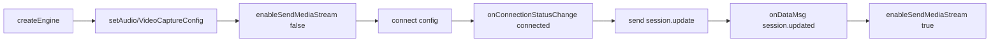

# realtime api user guide

Realtime API 是百炼平台提供的低延迟、高可靠实时交互能力，支持多模态（音视频+文本）流式处理。开发者可根据业务场景选择 AOQ、WebRTC 或 WebSocket 三种传输协议，在移动端原生应用、浏览器环境或服务端快速集成实时 AI 能力。协议选型直接影响弱网对抗能力、接入复杂度和模型支持范围。

## 支持的模型/功能

Realtime API 当前支持以下核心模型与应用类型，不同协议的支持情况存在差异：

- **实时全模态交互**：`qwen3.5-omni-plus-realtime`、`qwen3.5-omni-flash-realtime`、`qwen3.5-livetranslate-flash-realtime` —— 全协议支持（AOQ/WebRTC/WebSocket）  
- **多模态开发套件**：`multimodal-dialog` —— 全协议支持  
- **实时语音识别（ASR）**：`Qwen-Audio-3.0-ASR-Flash-Streaming`、`Fun-ASR-Realtime` 系列 —— **仅 AOQ 和 WebSocket 支持**，WebRTC 不支持（见 [Realtime API 概述](../../raw/model-api-reference/realtime-api-user-guide/realtime-api-overview.md)）  
- **实时语音合成（TTS）**：`CosyVoice` 系列 —— **仅 AOQ 和 WebSocket 支持**，WebRTC 不支持  
- **实时语音对话**：`qwen-audio-3.0-realtime-plus`、`qwen-audio-3.0-realtime-flash` —— 全协议支持  

> **注意**：文档 1 明确指出 WebRTC 不支持 ASR/TTS 模型，但文档 4 的 WebRTC 接入示例中未强调此限制，且未提供对应替代方案。实际接入时请以文档 1 的模型支持矩阵为准，避免因协议误配导致模型不可用。

## 关键参数

### 协议级参数
| 参数 | 说明 | 示例值 | 备注 |
|------|------|--------|------|
| `x-dashscope-rtc-transport` | 指定传输协议 | `moq`（AOQ）、`webrtc`、`websocket` | 必须在建连请求头中显式声明（见 [Token鉴权](../../raw/model-api-reference/realtime-api-user-guide/realtime-api-quick-start-guide/realtime-token-authentication.md)） |
| `clientIp` | 客户端真实公网 IP | `203.208.60.1` | AOQ 建连时选填，用于分配最优 Relay 接入点；不填则使用网关出口 IP |

### 会话配置参数（`session.update`）
| 字段 | 类型 | 必填 | 说明 |
|------|------|------|------|
| `modalities` | string[] | 是 | 输出模态，如 `["text", "audio"]`；WebSocket 仅支持 `["text"]`（见文档 4 示例） |
| `voice` | string | 否 | TTS 音色名，如 `"Ethan"` |
| `input_audio_format` | string | 是 | 输入音频格式，当前仅支持 `"pcm"`（16kHz） |
| `output_audio_format` | string | 是 | 输出音频格式，当前仅支持 `"pcm"`（24kHz） |
| `turn_detection` | object | 否 | VAD 配置，`type` 可选 `"server_vad"` 或 `"semantic_vad"`（推荐后者） |

## 使用方式

### 1. 协议选型与 SDK 获取
- **AOQ**：适用于移动端原生应用（Android/iOS/HarmonyOS），需下载 [AOQ SDK](../../raw/model-api-reference/realtime-api-user-guide/realtime-api-quick-start-guide/realtime-sdk-download.md)，并额外集成 Opus 插件  
- **WebRTC**：适用于浏览器端或已有 WebRTC 基础设施的场景，**无专用 SDK**，直接使用浏览器原生 API 或标准 WebRTC 库（见 [接入模型与应用](../../raw/model-api-reference/realtime-api-user-guide/realtime-api-quick-start-guide/realtime-connect-model.md)）  
- **WebSocket**：适用于服务端集成或快速原型验证，可复用现有 WebSocket SDK（参见 [安装SDK](https://help.aliyun.com/zh/model-studio/install-sdk)）  

### 2. 鉴权流程（统一）
所有协议均通过 `Authorization: Bearer <API_KEY>` 在建连阶段完成鉴权：
- **AOQ**：API Key 由业务 AppServer 侧使用，客户端使用网关返回的 `aoqTokenForClient` 连接（安全隔离）  
- **WebRTC/WebSocket**：API Key 可由客户端或服务端直接携带（**不推荐客户端硬编码**，见 [Token鉴权](../../raw/model-api-reference/realtime-api-user-guide/realtime-api-quick-start-guide/realtime-token-authentication.md) 安全提示）  

### 3. AOQ 核心控制流程（典型）

- 必须在收到 `session.updated` 后才启用媒体发送（见 [媒体流发送管理](../../raw/model-api-reference/realtime-api-user-guide/realtime-api-aoq-api/realtime-api-aoq-sdk-function/aoq-media-stream-control.md)）  
- 自定义采集/播放需通过 `isExternal=true` 配置，并配合 `pushAudioExternalStreamData` 或 `setAudioFrameObserver` 实现（见 [自定义音频采集](../../raw/model-api-reference/realtime-api-user-guide/realtime-api-aoq-api/realtime-api-aoq-sdk-function/aoq-custom-audio-capture.md) 和 [自定义音频播放](../../raw/model-api-reference/realtime-api-user-guide/realtime-api-aoq-api/realtime-api-aoq-sdk-function/aoq-custom-audio-playback.md)）  

## 限制和注意事项

- **协议兼容性限制**：WebRTC 不支持 ASR/TTS 模型，若需语音识别或合成能力，必须选用 AOQ 或 WebSocket 协议  
- **AOQ 连接状态管理**：`Failed` 状态为瞬态，SDK 会自动迁移到 `Disconnected`，业务层无需在 `onConnectionStatusChange(Failed)` 中调用 `disconnect`（见 [连接状态管理](../../raw/model-api-reference/realtime-api-user-guide/realtime-api-aoq-api/realtime-api-aoq-sdk-function/aoq-connection-management.md)）  
- **媒体流控制时机**：`enableSendMediaStream` 必须在 `createEngine` 之后调用；若未显式调用，`connect` 成功后 SDK 将立即开始发送媒体流（可能导致服务端未就绪而丢帧）  
- **外部音频/视频流**：推送 PCM 或原始帧时，需严格匹配采样率、声道数、分辨率等参数；缓冲区满（错误码 110）时需重试而非丢弃数据（见文档 9、10、12）  
- **安全要求**：API Key 绝对禁止硬编码于客户端代码或提交至代码仓库，应通过后端服务动态下发（见 [Token鉴权](../../raw/model-api-reference/realtime-api-user-guide/realtime-api-quick-start-guide/realtime-token-authentication.md)）

## 来源文档

- [Realtime API 概述](../../raw/model-api-reference/realtime-api-user-guide/realtime-api-overview.md)
- [SDK下载](../../raw/model-api-reference/realtime-api-user-guide/realtime-api-quick-start-guide/realtime-sdk-download.md)
- [Token鉴权](../../raw/model-api-reference/realtime-api-user-guide/realtime-api-quick-start-guide/realtime-token-authentication.md)
- [接入模型与应用](../../raw/model-api-reference/realtime-api-user-guide/realtime-api-quick-start-guide/realtime-connect-model.md)
- [AOQ SDK简介](../../raw/model-api-reference/realtime-api-user-guide/realtime-api-aoq-api/realtime-api-aoq-sdk-desc.md)
- [媒体流发送管理](../../raw/model-api-reference/realtime-api-user-guide/realtime-api-aoq-api/realtime-api-aoq-sdk-function/aoq-media-stream-control.md)
- [连接状态管理](../../raw/model-api-reference/realtime-api-user-guide/realtime-api-aoq-api/realtime-api-aoq-sdk-function/aoq-connection-management.md)
- [自定义音频播放](../../raw/model-api-reference/realtime-api-user-guide/realtime-api-aoq-api/realtime-api-aoq-sdk-function/aoq-custom-audio-playback.md)
- [音频常用功能介绍](../../raw/model-api-reference/realtime-api-user-guide/realtime-api-aoq-api/realtime-api-aoq-sdk-function/aoq-audio-features.md)
- [自定义音频采集](../../raw/model-api-reference/realtime-api-user-guide/realtime-api-aoq-api/realtime-api-aoq-sdk-function/aoq-custom-audio-capture.md)
- [视频常用功能介绍](../../raw/model-api-reference/realtime-api-user-guide/realtime-api-aoq-api/realtime-api-aoq-sdk-function/aoq-video-features.md)
- [自定义视频输入](../../raw/model-api-reference/realtime-api-user-guide/realtime-api-aoq-api/realtime-api-aoq-sdk-function/aoq-custom-video-input.md)

