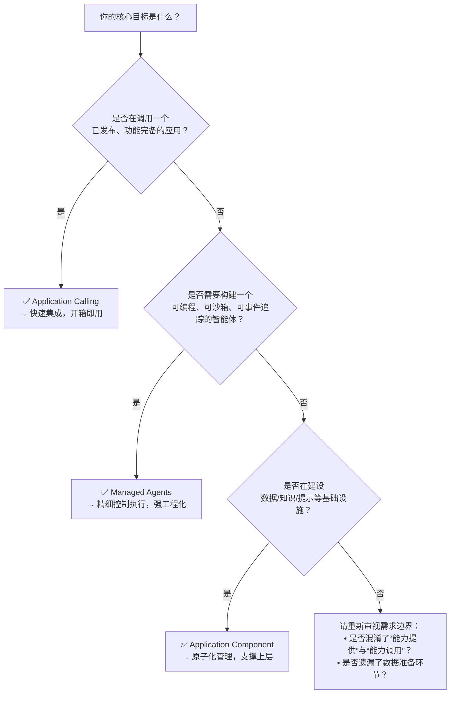

# 应用层核心 API 对比：Application Calling、Managed Agents 与 Application Component

为帮助开发者在百炼平台构建智能应用时做出清晰、可靠的技术选型，本文系统对比三大应用层核心 API 能力：**Application Calling**（应用调用）、**Managed Agents**（托管智能体）与 **Application Component**（应用组件）。三者定位不同——Application Calling 面向“已发布应用的端到端执行”，Managed Agents 面向“可编程、可编排的智能体运行时”，Application Component 则聚焦“数据与知识基础设施的原子化管理”。理解其差异是避免架构错配、提升开发效率与生产稳定性的关键前提。

---

## 关键维度对比

| 维度 | Application Calling | Managed Agents | Application Component |
|------|---------------------|----------------|------------------------|
| **核心定位** | 调用已发布、已配置完成的智能体或工作流应用（黑盒执行） | 构建、部署、运行可版本化、带沙箱与工具能力的智能体实例（灰盒运行时） | 管理应用底层数据资产与知识基础设施（白盒数据/知识/提示工程能力） |
| **输入格式** | • 字符串（单轮文本） • 消息数组（`role`/`content`/`type`），支持 `text`/`imageList`/`input_file`（仅智能体） • `biz_params` 透传业务参数 | • 严格遵循事件驱动消息结构：  `{"role": "user", "type": "user_message", "content": [...]}` • `content` 支持文本、文件引用（`file_id`）、结构化工具调用结果 • 所有输入需经 Session 绑定的 Agent + Environment 处理 | • 按模块分离：  – 数据连接：`AddFile`（二进制+元数据）、`AddTable`（结构化 schema）  – 知识库：`SubmitIndexJob`（文档路径列表）、`Retrieve`（query + filter）  – Prompt：`CreatePromptTemplate`（含 `${variable}` 占位符的字符串） |
| **输出格式** | • 同步：JSON 响应体含 `output.text` / `output.images` / `output.files`；流式响应为 SSE 或 chunked JSON • 异步：返回 `task_id`，后续 `GET /tasks/{id}` 获取最终结果（非流式） | • 全事件流（SSE）：  `session_status`（`idle`/`running`/`terminated`）  `message`（含 `role`/`content`/`tool_calls`）  `tool_result`（工具执行返回） • 无传统“终态响应体”，需客户端聚合事件流 |
| **支持模型** | • 智能体/工作流所绑定的任意百炼模型（Qwen-VL、Qwen-Max、Qwen-Plus、Qwen2 等） • 模型选择在应用创建/编辑阶段完成，API 调用时不指定 | • 仅支持百炼托管模型（当前明确支持 `qwen-plus` 等有限 ID） • 模型通过 `Agent.model.id` 显式声明，不可动态切换或自定义接入 | • **不直接调用大模型** • 为上层应用（如 Application Calling 中的智能体）提供数据源与知识支撑 |
| **API 端点（典型）** | • Responses API（OpenAI 兼容）：  `POST https://dashscope.aliyuncs.com/api/v2/apps/agent/{APP_ID}/compatible-mode/v1/responses` • DashScope API（原生）：  `POST https://dashscope.aliyuncs.com/api/v1/apps/{APP_ID}/completion` | • 统一基础路径：  `https://{workspace_id}.{region}.maas.aliyuncs.com/api/v1/agentstudio` • 资源路由示例：  `POST /agents` / `POST /environments` / `POST /sessions/{id}/events` | • ROA 风格，按能力域划分：  数据连接：`POST /bailian/2023-12-29/data-connection/files`  知识库：`POST /bailian/2023-12-29/knowledge-base/indexes`  Prompt：`POST /bailian/2023-12-29/prompt-engineering/templates` |
| **认证方式** | • APP ID + Workspace ID（部分地域必需） + DashScope API Key | • Workspace ID + Region + DashScope API Key（统一鉴权） | • Workspace ID + RAM AccessKey（AK/SK） + ROA 签名（需 SDK 或手动实现） |
| **计费方式** | • 按调用次数 + 模型 token 消耗计费（同底层模型计费规则） • [异步任务](../concepts/asynchronous-task.md)按实际执行时长与资源占用折算为等效 token 计费 | • 按 Session 运行时长（秒级） + 工具调用次数 + 文件处理量计费 • Agent/Environment 创建、File/Skill 上传等管理操作免费 | • 按资源使用量计费：  – 文件存储（GB/月）  – 知识库索引构建与查询（QPS + 文档页数）  – Prompt 模板调用量（次） |
| **会话状态管理** | • DashScope API：通过 `session_id`（有效期 1 小时）维护上下文 • Responses API：**不支持自动会话管理**，需显式传递完整历史消息数组 | • 内置全生命周期会话状态机（`idle` → `running` → `idle`/`terminated`） • 状态变更通过 SSE 实时推送，客户端无需维护状态快照 | • **无会话概念** • 所有接口均为无状态 RESTful 调用，状态由业务侧自行管理（如缓存 `IndexId`） |
| **多模态支持** | • ✅ 图像输入（需 VL 模型 + 应用配置） • ✅ 文件输入（仅智能体应用，支持全文引用/切片检索） | • ✅ 图像/音频作为 `content` 项上传（需先 `POST /files` 审核） • ✅ 文件可挂载至沙箱供工具读写 | • ✅ 文件上传（`AddFile` 支持 PDF/DOCX/PNG/JPG 等） • ❌ 不直接处理图像语义，仅作存储与索引源 |
| **典型场景** | • 客服对话机器人（Web/App 接入） • 工作流自动化（审批流、报告生成） • 第三方系统集成（ERP/CRM 触发智能分析） | • 需深度定制执行逻辑的智能体（如多步骤工具协同、复杂错误恢复） • 高隔离性需求场景（金融合规沙箱、客户专属环境） • 需细粒度观测与调试的 AI 工程化项目 | • 构建企业级知识库（产品文档、客服知识） • 管理多源异构数据（数据库连接、Excel 表格、非结构化文件） • 标准化 Prompt 模板库（营销文案生成、代码解释） |

---

## 适用场景建议

### ✅ 优先选用 **Application Calling**
- 你的应用已在百炼控制台完成开发、测试与发布，只需“调用”而非“重构”；
- 场景对实时性要求高（如在线客服），且输入以文本/图像为主，无需复杂工具链；
- 团队熟悉 [OpenAI 兼容接口](../concepts/openai-compatible-interface.md)，希望最小成本迁移现有 SDK 代码；
- 业务逻辑相对稳定，无需频繁变更执行流程或沙箱环境。

### ✅ 优先选用 **Managed Agents**
- 你需要完全掌控智能体的执行过程：例如插入自定义日志、拦截工具调用、实现重试/回滚策略；
- 应用涉及敏感操作（如调用内部 API、读写客户数据库），必须运行在隔离沙箱中；
- 智能体需组合多个 Skill（如“查天气”+“订机票”+“发邮件”），且各 Skill 版本需独立演进；
- 项目处于 AI 工程化探索期，需要可观测事件流（`tool_result`、`session_status`）辅助调试与监控。

### ✅ 优先选用 **Application Component**
- 你正在搭建应用的数据底座：统一纳管客户资料、产品手册、销售合同等非结构化/结构化数据；
- 需要构建可复用、可审计的知识服务（如 `Retrieve` 接口供多个前端调用）；
- Prompt 设计已成为团队标准实践，需集中管理、AB 测试与灰度发布模板；
- 当前使用 Application Calling 或 Managed Agents 时，频繁遇到“知识更新滞后”“数据源分散”“提示词散落各处”等问题。

> ⚠️ **重要提醒**：三者并非互斥，而是典型的**分层协作关系**。  
> **最佳实践架构**：  
> `Application Component`（提供知识库 Index + 数据连接 File）  
> ↓（作为数据源注入）  
> `Managed Agents`（构建具备工具能力的智能体，从知识库检索并调用业务 API）  
> ↓（封装为标准化应用）  
> `Application Calling`（供前端/第三方系统一键调用）  

---

## 技术选型决策树（面向开发者）

**补充判断要点**：
- 若需 **跨地域部署**：Application Calling 和 Managed Agents 当前均**仅支持华北2（北京）**；Application Component 支持多地域接入点（需显式配置 endpoint）。
- 若需 **最小权限管控**：Application Component 依赖 RAM 精细策略（如 `sfm:Retrieve`）；Application Calling 与 Managed Agents 使用统一 DashScope API Key，权限粒度较粗。
- 若需 **流式响应**：Application Calling（同步+stream=true）与 Managed Agents（SSE）均支持；Application Component 的 `Retrieve` 为同步 JSON 响应，不支持流式。
- 若存在 **长期会话需求**（>1 小时）：Application Calling 的 `session_id` 会过期，需业务侧续期；Managed Agents 的 Session 可长期保持 `idle` 状态，支持更灵活的保活策略。

---  
*最后更新：2024年6月*  
*适用百炼平台 v2.3.x 及以上版本*

## 被对比主题页

- [application call](../api/application-call.md)
- [managed agents api](../api/managed-agents-api.md)
- [application component api reference](../api/application-component-api-reference.md)

