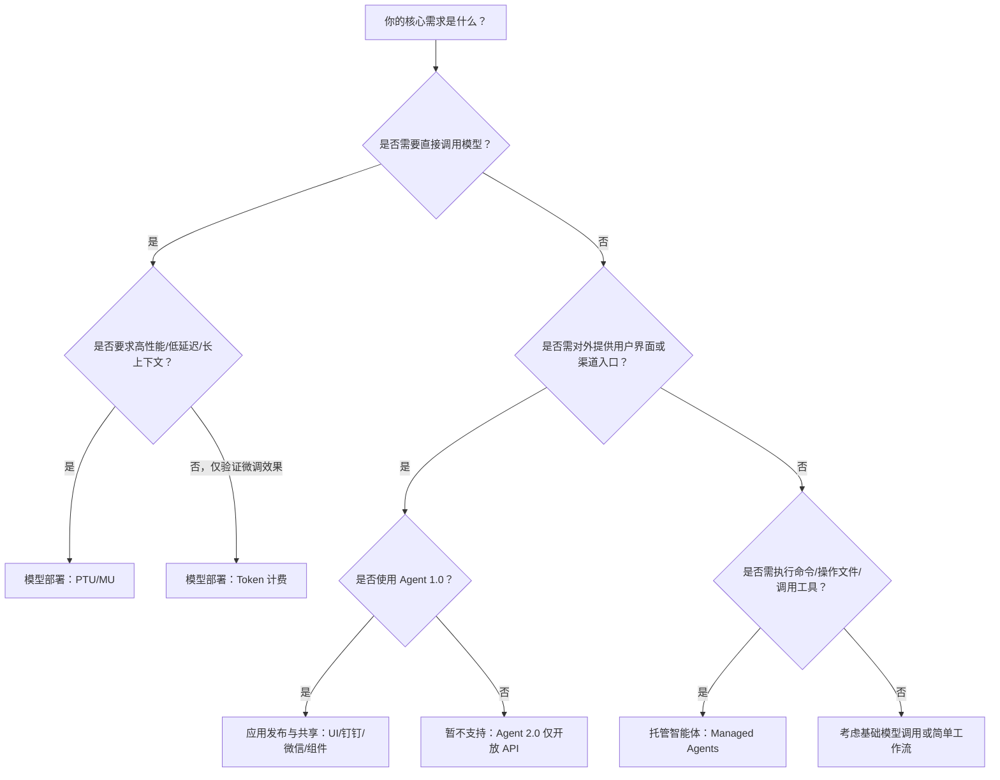

# 应用部署方式对比：模型部署、应用发布与托管智能体

## 背景与目的  
在百炼平台生态中，开发者面临多种面向生产环境的“能力交付”路径：可直接调用的底层模型服务、封装交互逻辑的智能体应用、以及支持复杂任务编排的托管运行时。三者定位不同、能力边界清晰，但易因术语相近（如“部署”“发布”“托管”）产生混淆。本文旨在从技术本质、使用范式与工程约束出发，系统对比 **模型部署（Model Deployment）**、**应用发布与共享（Application Publishing & Sharing）** 和 **托管智能体（Managed Agents）** 三大核心能力，帮助开发者基于业务目标、技术栈成熟度与运维诉求，做出精准的技术选型决策。

---

## 关键维度对比表

| 维度 | 模型部署（Model Deployment） | 应用发布与共享（Application Publishing & Sharing） | 托管智能体（Managed Agents） |
|------|------------------------------|-----------------------------------------------|-----------------------------|
| **本质定位** | 将大语言模型/[多模态](../concepts/multi-modal.md)模型封装为标准化 API 服务，提供原始推理能力 | 将已构建的智能体或工作流应用以用户可访问的形式对外分发（UI、机器人、组件等），聚焦交互触点与渠道集成 | 提供具备沙箱环境、工具链与会话状态管理的智能体运行时，专为长周期、多步骤、需执行操作的任务设计 |
| **输入格式** | 原始 Prompt（text）、结构化消息（OpenAI 兼容 format）、[多模态](../concepts/multi-modal.md)输入（image_url / file_ref，依模型支持） | UI 表单字段、钉钉/微信消息文本、组件调用参数（`query`, `imageList`）、音视频实时流事件 | 用户消息事件（SSE 流中 `role: "user"`），支持 text、file_ref、audio_ref 等[多模态](../concepts/multi-modal.md)块；支持挂载文件资源（≤10 MB/个） |
| **输出格式** | 单次响应流式或非流式文本（`content`）、token 统计、usage 字段；不返回中间过程 | 最终响应文本/卡片/富媒体内容；UI 应用支持自定义渲染；组件调用返回结构化 JSON；机器人返回平台消息格式 | SSE 事件流：`message`（最终回复）、`tool_call`（工具调用请求）、`tool_output`（工具执行结果）、`session_status`（会话状态）；支持完整执行轨迹回溯 |
| **支持模型** | • PTU/MU：`glm-5.1`, `deepseek-v4-pro`, `qwen3.7-plus-2026-05-26` 等全系列千问/GLM/DeepSeek/CosyVoice • [Token](../concepts/token.md) 计费：仅 LoRA 微调模型（如 `qwen3-8b-ft-*`） | **不直接绑定模型**；依赖所发布智能体/工作流内部配置的模型（Agent 1.0 支持任意已部署模型或内置模型） | 严格限定：`qwen3-max`, `qwen3.7-plus` 等 Qwen 系列官方模型（不支持自定义模型镜像或 LoRA） |
| **API 端点与调用方式** | `POST /api/v1/deployments`（创建） `Generation.call(model='xxx', ...)` 或 OpenAI 兼容 `/v1/chat/completions` | • UI/机器人：HTTP 回调地址或 SDK 集成 • 组件：作为工具节点被其他智能体/工作流调用（内部 RPC） • 音视频：AICallKit SDK 接入 | `POST /sessions/{id}/events`（提交用户消息） `GET /sessions/{id}/events/stream`（SSE 流式监听） 需显式管理 Session 生命周期 |
| **计费方式** | • PTU：预购吞吐额度（KTPM），按容量计费 • MU：按实例规格（MU1/MU2…）+ 运行时长计费 • [Token](../concepts/token.md)：LoRA 模型按实际 token 用量计费 | **所有渠道调用均计入应用创建者 UID 的模型调用账单**；UI 生产环境需额外订阅套餐；文件/数据库超出免费配额后按量计费 | 按 Session 实际运行时长（秒级）+ 工具执行资源消耗计费；沙箱环境按规格（CPU/GPU/内存）单独计费 |
| **典型场景** | • 高并发客服问答 API • 低延迟文档摘要服务 • 定制化微调模型在线推理（LoRA） • 私有化部署需独占资源与精细限流 | • 内部员工使用的钉钉智能助手 • 面向客户的魔笔 Web 应用（如产品咨询页） • 将数据分析智能体发布为组件，供多个业务线复用 • H5 页面嵌入音视频实时对话入口 | • 自动化代码审查与修复 • 多步[文件处理](../concepts/file-processing.md)（下载→解析→生成报告→邮件发送） • 需 Bash 脚本执行与文件编辑的运维辅助 Agent • 集成 MCP 外部服务的复杂业务流程编排 |
| **核心能力边界** | ✅ 高性能、低延迟、长上下文、前缀缓存、细粒度限流 ❌ 无会话状态管理、无工具调用、无沙箱执行 | ✅ 多渠道分发、低代码 UI 构建、组件化复用、权限与匿名访问控制 ❌ 不支持 Agent 2.0、无执行环境、无事件流反馈 | ✅ 自主工具调用、沙箱内命令执行、文件读写编辑、MCP 服务接入、完整事件流可观测性 ❌ 不提供前端界面、不支持直接对外发布、单会话最长 2 小时 |

---

## 适用场景建议（面向开发者）

| 业务需求 | 推荐方案 | 关键理由 | 注意事项 |
|----------|----------|----------|----------|
| **需要将自有微调模型（LoRA）快速上线验证效果，且调用量低、成本敏感** | ✅ 模型部署（[Token](../concepts/token.md) 计费模式） | 仅支持 LoRA 模型，按量付费无闲置成本；无需配置复杂参数 | 仅限 LoRA 模型；不支持 PTU/MU 的性能优化能力（如前缀缓存、思考模式） |
| **构建高 SLA 要求的生产级 API（如日均百万请求、P99 < 500ms）** | ✅ 模型部署（PTU 或 MU） | PTU 提供确定性吞吐保障；MU 支持 PD 分离、RPM/TPM 限流、思考模式等私有化定制能力 | PTU/MU 创建后计费模式不可变更；需提前预估流量并规划容量 |
| **希望零代码快速上线一个面向终端用户的 Web 应用（含表单、按钮、数据展示）** | ✅ 应用发布与共享（UI 应用） | 魔笔设计器拖拽即用；支持数据库、HTTP 服务集成；开发环境免费试用 | 仅支持 Agent 1.0；生产环境需订阅套餐并绑定自定义域名 |
| **需将一个智能体能力复用到多个业务系统中（如：风控规则引擎、HR 政策问答器）** | ✅ 应用发布与共享（组件化发布） | 发布为组件后，其他智能体/工作流可一键接入；支持参数别名、可见性控制与传参方式配置 | 工作流中组件参数必须由上游显式传入，不支持模型自动识别填充 |
| **任务涉及多轮交互 + 文件操作 + 命令执行（如：“分析附件财报，生成 PPT 并邮件发送”）** | ✅ 托管智能体（Managed Agents） | 原生支持 `bash`/`read`/`write`/`download_file` 等工具；沙箱内持久化文件系统；完整事件流反馈执行全过程 | 必须使用 `qwen3-max` 等指定模型；需主动管理 Session 生命周期；单会话最长 2 小时 |
| **需对接企业微信/钉钉，为内部员工提供轻量级 AI 助手** | ✅ 应用发布与共享（钉钉/微信机器人） | 一键配置、免开发接入；消息自动路由至对应智能体；权限与审计由百炼统一管控 | 仅支持 Agent 1.0；不支持 Agent 2.0 应用；需确保业务空间一致性 |
| **需构建具备自主规划、工具调用、代码执行能力的强智能体，并深度定制沙箱环境（如预装特定 pip 包）** | ✅ 托管智能体（Managed Agents） | 支持自定义 Environment（apt/pip 预装、网络策略）；工具集开箱即用；MCP 可扩展外部服务能力 | 不开放沙箱 root 权限；`bash` 命令无法访问宿主机；Session 终止后沙箱销毁 |

---

## 技术选型决策树（简明版）

> 💡 **关键提醒**：  
> - **版本兼容性是硬门槛**：Agent 2.0 应用完全无法通过魔笔、钉钉、微信等渠道发布，务必确认智能体版本；  
> - **计费归属需明确**：应用发布产生的所有模型调用费用均由创建者 UID 承担，与调用方无关；  
> - **资源隔离层级不同**：PTU/MU 隔离模型级资源，Managed Agents 隔离沙箱级环境，应用发布不涉及底层资源分配；  
> - **组合使用更高效**：典型架构如 —— 使用 *模型部署* 提供高性能基础模型 API → 在 *应用发布* 中构建 UI 调用该 API → 将复杂任务委托给 *托管智能体* 执行。  

如需进一步评估具体场景，建议结合 [模型部署快速入门](../../raw/model-user-guide/model-deployment-1/model-deployment-quick-start.md)、[UI 设计器指南](../../raw/application-user-guide/application-publishing-and-sharing/ui-designer.md) 与 [托管智能体快速开始](../../raw/application-user-guide/managed-agents/managed-agents-quick-start.md) 实践验证。

## 被对比主题页

- [model deployment 1](../guides/model-deployment-1.md)
- [application publishing and sharing](../guides/application-publishing-and-sharing.md)
- [managed agents](../guides/managed-agents.md)

