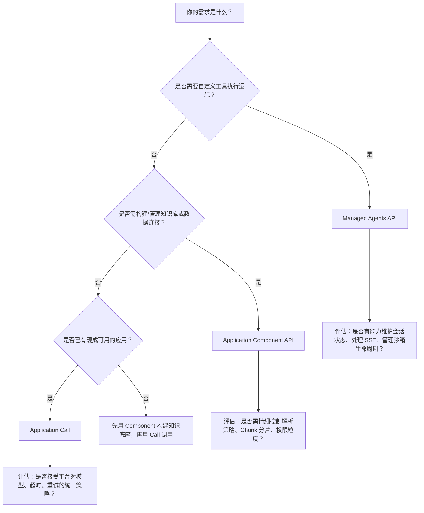

# 应用编排能力对比：Managed Agents API vs Application Component API vs Application Call

## 背景与目的  
在百炼平台构建企业级 AI 应用时，开发者常需在不同抽象层级间进行技术选型：是直接托管智能体运行时（Managed Agents），还是复用平台基础能力组件（Application Component），抑或快速调用已发布的成熟应用（Application Call）？三者定位差异显著——**Managed Agents API 面向“可编程智能体系统”的深度定制；Application Component API 聚焦“数据与知识基础设施”的原子能力编排；Application Call 则服务于“开箱即用型应用”的轻量集成**。本文旨在从工程实践视角，系统对比三者的输入输出、模型支持、部署模型、计费逻辑与适用边界，帮助开发者基于业务复杂度、运维诉求与交付节奏做出理性技术选型。

---

## 关键维度对比表

| 维度 | Managed Agents API | Application Component API | Application Call |
|------|---------------------|----------------------------|-------------------|
| **核心定位** | 智能体全生命周期托管运行时（含沙箱、会话、事件流） | 平台级基础能力组件（数据连接、知识库、[Prompt 工程](../concepts/prompt-engineering.md)） | 已发布智能体/工作流的标准化调用入口 |
| **输入格式** | `Event` 对象数组（含 `role`, `type`, `content`, 文件引用）；需显式构造 `Session` + `Agent` + `Environment` 上下文 | 多样化资源操作请求： • 数据接入：`ApplyFileUploadLease` + `AddFile`（含 `Parser`） • 知识库：`CreateIndex` + `SubmitIndexJob` • Prompt：`CreatePromptTemplate`（JSON 模板） | 简洁应用输入： • 字符串（单轮文本） • 消息数组（多轮/图像/文件） • 支持 `stream=true` 或 `background=true` 控制交互模式 |
| **输出格式** | SSE 流式事件（`session_status`, `tool_call`, `assistant_message` 等）+ RESTful 同步响应（如 Session 创建结果） | RESTful 同步响应为主： • `ListFile` 返回文件元信息 • `Retrieve` 返回结构化检索结果 • `GetPromptTemplate` 返回模板 JSON | 三种模式： • 同步：完整 JSON 响应（含 `output.text`） • 流式：SSE Chunk（`data: {...}`） • 异步：任务 ID + 轮询 `GET /tasks/{id}` |
| **支持模型** | 显式指定 `model.id`（如 `"qwen-plus"`），需在 Agent 创建时绑定；支持百炼已开通的推理模型 | **不直接调用模型**；为模型提供数据支撑（知识库检索结果、Prompt 模板注入、结构化数据输入） | 由被调用的 App 内部决定；调用方无需关心模型细节（透明封装）；支持 VL 模型处理图像等多模态输入 |
| **API 端点** | `https://{workspace_id}.{region}.maas.aliyuncs.com/api/v1/agentstudio`（`region` 仅限 `cn-beijing`） | `https://bailian.{region}.aliyuncs.com`（如 `bailian.cn-beijing.aliyuncs.com`），按地域分服务地址 | `https://dashscope.aliyuncs.com/api/v1/apps/{APP_ID}/completion`（DashScope 原生） `https://dashscope.aliyuncs.com/api/v2/apps/agent/{APP_ID}/compatible-mode/v1/responses`（OpenAI 兼容） |
| **鉴权方式** | Bearer Token（`Authorization: Bearer <API Key>`），API Key 在百炼控制台创建 | ROA 签名机制（AccessKey ID/Secret），推荐使用 SDK 自动签名；需 RAM 授权（如 `sfm:Retrieve`） | Bearer Token（`Authorization: Bearer <DASHSCOPE_API_KEY>`），与 DashScope 生态统一 |
| **计费方式** | 按 **Agent 运行时消耗** 计费： • Session 生命周期内模型 Token、工具执行、沙箱资源占用 • 文件存储（30天）、技能扫描等附加费用 | 按 **组件使用量** 计费： • 知识库索引构建与存储（GB/月） • 文件解析次数（次） • Prompt 模板调用（次） • 检索 QPS（超出免费额度后） | 按 **应用调用次数与输出 Token** 计费： • 同步/异步调用均计入调用次数 • [流式输出](../concepts/streaming-output.md)按实际生成 Token 计费 • 与所调用 App 的计费策略一致（App 发布者配置） |
| **典型场景** | • 需自定义工具链与沙箱环境的金融风控助手 • 多步骤、长周期、状态敏感的客服工单处理流程 • 需实时监听工具执行中间结果的自动化运维 Agent | • 构建企业专属知识库（PDF/Excel/音视频）并对接业务系统 • 将 CRM 表格数据接入 Prompt 模板生成销售话术 • 动态管理数百个 Prompt 版本用于 A/B 测试 | • 前端 Web/App 直接嵌入客服机器人 • ERP 系统通过 API 调用合同审核工作流 • 快速集成第三方 SaaS 提供的 AI 插件（如会议纪要生成） |

---

## 适用场景建议

### ✅ 选择 **Managed Agents API** 当：
- 你需要**完全掌控智能体行为逻辑**：例如定义复杂的状态机（`idle → running → waiting_for_tool → idle`），精确拦截并处理每个工具调用事件；
- 业务要求**强隔离与安全沙箱**：如处理用户上传的代码文件，需在云端隔离环境中执行并捕获 stdout/stderr；
- 存在**多版本协同演进需求**：Agent 配置、Environment 依赖、Skill 工具包需独立版本管理，并支持灰度发布；
- 开发团队具备**事件驱动架构经验**，能妥善处理 SSE 流、会话超时、中断恢复等底层细节。

### ✅ 选择 **Application Component API** 当：
- 你的核心挑战是**数据准备与知识治理**：例如将 500 份产品手册 PDF 构建为可检索的知识库，或把数据库视图同步为 Prompt 可引用的变量；
- 需要**解耦模型能力与数据层**：让同一套 Prompt 模板适配不同知识库（测试库/生产库），或动态切换解析器（`DOCMIND_DIGITAL` vs `AUTO_SELECT`）；
- 项目处于**MVP 验证阶段**：快速验证“用 RAG 提升问答准确率”是否成立，无需编写 Agent 逻辑，专注数据质量与检索效果；
- 团队角色分离明确：**数据工程师负责 Component 管理，算法工程师专注模型微调，前端工程师调用 Application Call**。

### ✅ 选择 **Application Call** 当：
- 你追求**最快上线速度与最低维护成本**：已有现成的“报销单识别”App，只需 3 行代码调用即可集成到 OA 系统；
- 客户侧存在**严格的合规要求**：必须使用平台认证的、已通过安全审计的预发布应用，禁止自行部署 Agent；
- 集成方技术栈受限：如遗留 Java 系统只能调用 [OpenAI 兼容接口](../concepts/openai-compatible-api.md)，此时 Responses API 提供零改造迁移路径；
- 业务流量波动大：依赖百炼平台自动扩缩容能力，无需自行管理 Session 并发数与沙箱资源池。

---

## 技术选型决策树（面向开发者）

> **关键提醒**：三者并非互斥，而是**分层协作关系**。典型生产架构常组合使用：  
> **Application Component** 构建知识库 → **Managed Agents** 封装领域专家 Agent → **Application Call** 对外提供标准化服务接口。  
> 开发者应避免“过度设计”（如用 Managed Agents 实现简单问答）或“能力缺失”（如用 Application Call 试图绕过沙箱执行 Python 代码）。始终以**最小可行抽象**匹配业务复杂度。

## 被对比主题页

- [managed agents api](../api/managed-agents-api.md)
- [application component api reference](../api/application-component-api-reference.md)
- [application call](../api/application-call.md)

