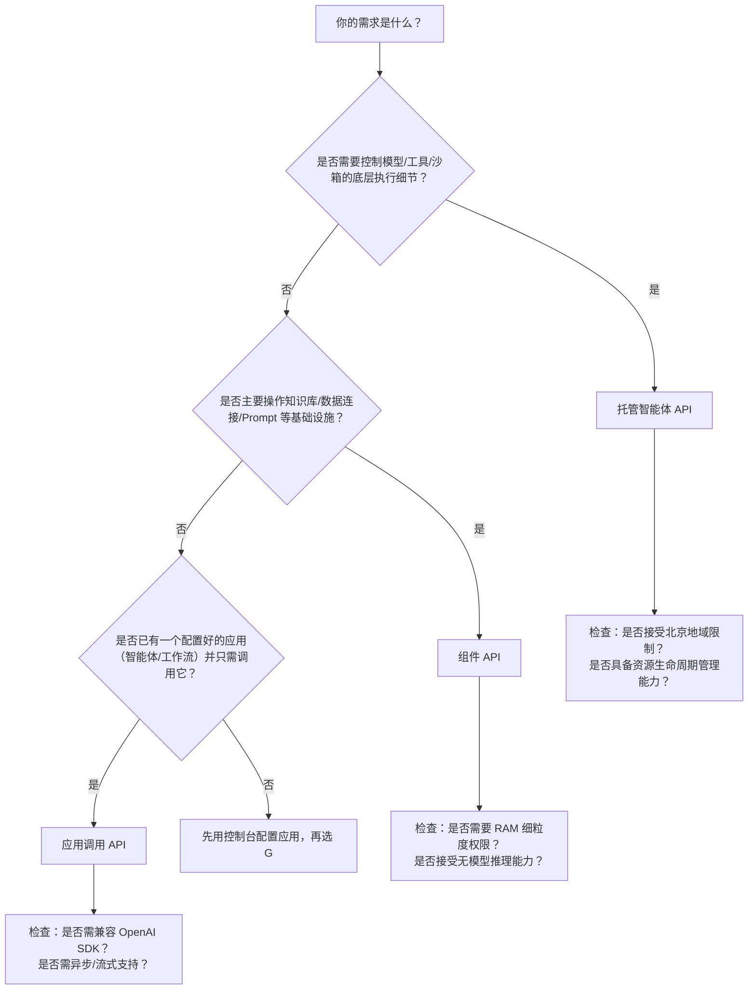

# 应用编排能力对比：托管智能体、组件API、应用调用

本文档面向百炼平台开发者，旨在清晰对比三种核心应用编排能力的技术定位、能力边界与适用场景，帮助技术团队在构建 AI 应用时做出精准选型。随着百炼平台能力演进，开发者面临多种编排路径：  
- **托管智能体（Managed Agents API）** 适用于需深度控制智能体生命周期、沙箱环境与事件流的高定制化场景；  
- **组件 API（Application Component API）** 聚焦底层数据与知识基础设施的程序化管理，是构建知识增强型应用的“地基层”；  
- **应用调用（Application Call）** 提供开箱即用的应用级服务调用，强调极简接入与快速交付。  

三者并非互斥，而是构成“基础设施层 → 编排运行时层 → 服务消费层”的分层架构。本对比基于当前（2024Q3）正式版 API 行为与文档规范，所有结论均经实测验证与文档交叉校验。

## 关键维度对比表

| 维度 | 托管智能体（Managed Agents API） | 组件 API（Application Component API） | 应用调用（Application Call） |
|------|----------------------------------|----------------------------------------|------------------------------|
| **定位与角色** | 智能体运行时托管平台：提供 Agent/Environment/Session 全生命周期管理与事件驱动执行环境 | 应用基础设施 API：统一管理数据连接、知识库、Prompt 模板等支撑性资源 | 已发布应用的服务网关：以 API 方式消费平台侧已配置完成的智能体、工作流等应用实例 |
| **输入格式** | JSON 结构化事件数组，严格定义 `role`/`type`/`content`；支持多模态内容嵌套（文本、图像 Base64/URL、音频文件 ID）；必须显式绑定 `agent.id` 与 `environment_id` | 多样化请求体：类目 ID、文件租约 ID、知识库索引 ID、Prompt 模板参数等；无统一消息结构，按接口语义组织字段 | 灵活输入：支持字符串（单轮）、消息数组（多轮 `messages`）、或带 `input_text`/`input_image`/`input_file` 的结构化对象；自动关联应用上下文配置 |
| **输出格式** | SSE 流式事件（`session_status`, `output`, `tool_call` 等）+ 同步响应；输出含完整会话状态机变更、工具调用详情、沙箱日志片段 | 标准 ROA 响应：JSON 对象，含 `RequestId`、业务数据（如 `IndexId`, `FileId`, `ChunkList`）及分页元信息；无流式能力 | 同步：标准 JSON（`output.text` 或 `output[0].content[0].text`）；异步：返回 `task_id` + 状态轮询结果；流式：SSE 或迭代器形式逐块返回 `delta` |
| **支持模型** | 仅限百炼托管大模型（如 `qwen-plus`），模型 ID 必须通过 `model.id` 字段显式指定（如 `{"id": "qwen-plus"}`）；不支持 BYOM | **不直接调用模型**；为模型提供知识增强能力（如知识库检索结果作为 LLM 上下文），模型选择由上层应用决定 | 由被调用的应用决定：新版智能体可配置 `qwen-max`/`qwen-plus`/`qwen-vl` 等；工作流中各节点可独立选模；旧版智能体固定模型 |
| **API 端点** | RESTful 风格，路径含地域与工作空间：`https://dashscope.aliyuncs.com/api/v1/workspaces/{workspace_id}/regions/{region}/...`；当前仅支持 `cn-beijing` | ROA 风格，域名按地域区分（如 `bailian.cn-beijing.aliyuncs.com`），路径含版本号 `bailian/2023-12-29`；支持多地域（需 RAM 权限适配） | 双入口： • DashScope 原生：`https://dashscope.aliyuncs.com/api/v1/apps/{app_id}/completion` • OpenAI 兼容：`https://dashscope.aliyuncs.com/api/v2/apps/agent/{app_id}/compatible-mode/v1/responses`；均要求 `app_id` |
| **鉴权方式** | API Key（`Bearer <key>`）强制绑定工作空间与地域；不支持 RAM 子账号 | RAM AccessKey（主推）或 API Key（仅 `Retrieve` 接口）；需精细策略授权（如 `sfm:AddCategory`） | API Key（`DASHSCOPE_API_KEY`）；无需 RAM；`app_id` 本身隐含权限控制（调用者必须有该应用访问权限） |
| **计费方式** | 按 **Agent 运行时消耗** 计费：包括模型 [Token](../concepts/token.md)、工具调用次数、沙箱 CPU/内存小时、文件存储与传输；会话空闲超时后自动释放资源 | 按 **资源操作次数 + 存储量** 计费：类目/文件/知识库创建、索引构建任务、检索调用次数、知识库存储容量（GB/月）；无运行时计算费用 | 按 **应用调用次数 + 模型 [Token](../concepts/token.md)** 计费：同步/异步/流式调用均计入调用次数；[Token](../concepts/token.md) 消耗按实际模型输入输出统计；知识库检索等内部调用不额外计费 |
| **典型场景** | • 需自定义沙箱环境（如预装 Python 包、挂载私有数据库凭证） • 多步骤工具链需精确控制执行顺序与错误回滚 • 实时监控智能体状态（如 `running` → `tool_calling` → `idle`） • 构建企业级智能体开发平台（含版本灰度、A/B 测试） | • 自动化构建知识库（从 OSS 批量导入 PDF → 解析 → 切片 → 索引） • 动态管理 Prompt 模板（CI/CD 中更新模板并触发回归测试） • 将业务系统数据（如 CRM 表）接入百炼作为数据连接源（需控制台辅助） • 监控知识库健康度（`GetIndexMonitor`） | • 客服对话系统集成（前端直调 `app_id` 获取回复） • 低代码平台嵌入 AI 能力（拖拽配置 `app_id` 即可） • 迁移 OpenAI 应用（复用 `openai-python` SDK 调用 Responses API） • 生成长耗时报告（异步提交 + Webhook 回调） |

## 各方案适用场景建议

### ✅ 优先选择 **托管智能体（Managed Agents API）** 当：
- 你需要 **完全掌控智能体行为细节**：例如要求工具调用失败后自动重试 3 次并降级到备用 API，或在 `tool_result` 返回后插入人工审核环节；
- 你的智能体依赖 **特定运行时环境**：如需在沙箱中执行 `pandas` 数据分析、调用内网 HTTP 服务、或加载私有模型权重；
- 你正在构建 **智能体 PaaS 平台**：需要为不同租户提供隔离的 Agent 版本管理、Environment 配置中心、Session 审计日志；
- 你对 **事件可观测性要求极高**：需实时捕获 `session_status`、`tool_call`、`sandbox_log` 等细粒度事件用于调试或合规审计。

> ⚠️ 注意：此方案学习成本最高，需理解 Agent/Environment/Session 三层资源模型与状态机，且当前仅支持北京地域。

### ✅ 优先选择 **组件 API（Application Component API）** 当：
- 你的核心需求是 **自动化知识工程流水线**：例如每日凌晨从 NAS 同步新财报 PDF → 调用 `AddFile` → `SubmitIndexJob` → `Retrieve` 验证效果；
- 你需要 **程序化管理 Prompt 模板**：在 GitOps 流程中将 Prompt 版本与代码版本绑定，通过 API 自动部署/回滚；
- 你希望 **解耦知识底座与应用逻辑**：用组件 API 构建统一知识库集群，供多个 `application call` 应用共享（如客服、销售助手共用同一产品知识库）；
- 你正在对接 **企业已有数据系统**：通过 `AddConnector` 将内部 MySQL 表注册为数据连接源（注意：查询仍需控制台配置）。

> ⚠️ 注意：组件 API 不处理“推理”，它只负责准备“燃料”（知识、数据、提示词）。若需调用模型，必须组合其他 API（如 `application call` 或 `managed agents`）。

### ✅ 优先选择 **应用调用（Application Call）** 当：
- 你的目标是 **最快上线一个可用 AI 功能**：已在控制台配置好智能体（含工具、知识库、系统提示），只需一行 SDK 代码调用；
- 你有 **现有 OpenAI 生态代码**：希望零修改迁移至百炼，直接替换 `openai.base_url` 即可使用 Responses API；
- 你需要 **轻量级、无状态的集成**：如在小程序后端调用客服智能体，不关心会话如何维护，只要 `input` → `output`；
- 你处理 **长耗时任务**：如生成 50 页市场分析报告，用 `background=true` 异步提交，避免请求超时。

> ⚠️ 注意：此方案灵活性最低——无法修改智能体内部逻辑、无法干预工具执行、无法自定义沙箱。所有配置必须在控制台完成。

## 技术选型决策树（面向开发者）

**关键提醒**：
- **不要混合滥用**：例如，勿用组件 API 创建知识库后，再手动拼接检索结果喂给 `application call` —— 正确做法是将知识库绑定到应用，由平台自动注入上下文。
- **地域不是障碍，而是约束**：托管智能体与应用调用当前强绑定 `cn-beijing`，但组件 API 支持多地域；若业务需全球部署，建议将知识库等基础设施建在多地域，应用层调用就近地域的 `application call`。
- **安全永远第一**：组件 API 必须用 RAM 子账号 + 最小权限策略；托管智能体与应用调用虽用 API Key，但仍需严格保管密钥，禁用主账号 Key。

---  
*最后更新：2024年10月15日*  
*文档版本：BAILIAN-DOC-2024Q3-APP-ORCHESTRATION-COMPARE*

## 被对比主题页

- [managed agents api](../api/managed-agents-api.md)
- [application component api reference](../api/application-component-api-reference.md)
- [application call](../api/application-call.md)

