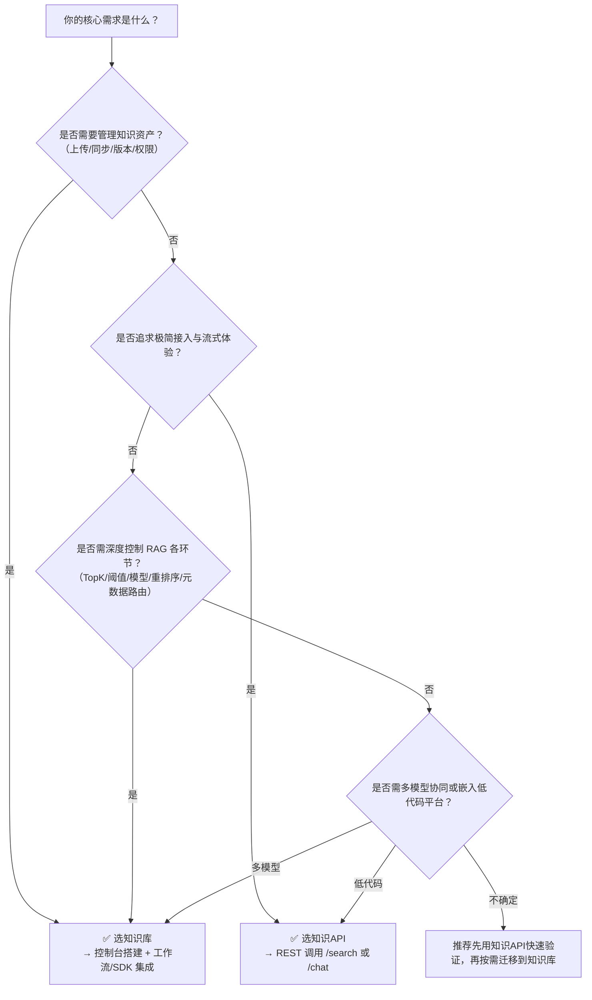

# 知识库（指南）与知识API（功能）对比

本文旨在帮助开发者清晰区分百炼平台中两类核心 RAG 能力：**知识库（Knowledge Base，指南型能力）** 与 **知识API（Knowledge API，功能型服务）**。二者虽均基于 RAG 架构、共享底层向量索引与模型服务，但在定位、使用方式、控制粒度、集成路径及计费逻辑上存在本质差异。正确理解其边界与协同关系，是构建稳定、可维护、可扩展的智能应用（如客服助手、内部知识中枢、AI 工作流）的关键前提。

> ⚠️ 重要前提：  
> - 两者**均仅支持华北2（北京）地域**，跨地域调用将失败；  
> - 所有知识API调用**必须依赖已创建并发布（active）的知识库**，知识API本身不提供知识存储或索引构建能力；  
> - 知识库是“数据+配置”的实体资源，知识API是“能力+接口”的服务通道——前者是后者运行的必要基础。

## 关键维度对比

| 维度 | 知识库（指南） | 知识API（功能） |
|------|----------------|------------------|
| **本质定位** | **RAG 数据基础设施**：面向知识资产全生命周期管理（上传→解析→切片→向量化→索引→版本控制→同步） | **RAG 能力服务接口**：面向实时语义交互，提供标准化检索与问答能力封装，不涉及数据治理 |
| **输入格式** | • 控制台：支持 PDF/DOCX/PPTX/XLSX/TXT/图片（JPG/PNG）、音视频（MP4/MOV/WAV/MP3）等多模态文件 • API（`CreateIndex`等）：支持 OSS URI、本地文件流、Base64 编码文本 • 工作流/智能体：支持变量传入（如 `{{input.query}}`） | • `/search`：JSON Body 中 `query` 字段（字符串），可选 `top_k`、`filter`（元数据过滤）、`knowledge_base_ids`（指定知识库列表） • `/chat`：标准 ChatML 格式 `messages` 数组（含 `role`/`content`），支持 `stream: true/false` |
| **输出格式** | • 控制台：可视化检索结果（切片原文+相似度+来源+metadata） • 工作流节点：结构化 JSON 输出（含 `nodes[]` 切片数组、`query_rewrite`、`rerank_scores` 等） • SDK API：`RetrieveResponse` 对象（含 `nodes`、`query`、`pipeline_id` 等字段） | • `/search`：JSON 响应，含 `code`、`message`、`data.nodes[]`（每个切片含 `content`、`score`、`metadata`、`source`） • `/chat`：SSE 流式响应（`event: message` / `event: tool_call` / `event: done`），最终聚合为含 `answer`、`citations`（引用切片ID）、`planning_steps` 的完整 JSON |
| **支持模型** | • **显式可控**：  - 检索阶段：可选 `qwen3-rerank`、`qwen3-vl-rerank`、`bge-reranker-large` 等专用排序模型  - 问答阶段：可自由切换千问全系列（Qwen3/Qwen2.5/Plus/Turbo/VL-Max等）及第三方模型（DeepSeek-R1/Llama3.1/Yi-Large）  - 路由阶段：固定使用 `qwen-plus`（产生额外费用） | • **隐式托管**：  - 全链路由由平台自动调度，**不暴露模型选择参数**  - 实际使用的 embedding 模型、rerank 模型、LLM 均由服务端统一升级与维护，开发者无法指定或覆盖 |
| **API 端点** | • SDK 接口为主：  `CreateIndex`, `DeleteIndex`, `Retrieve`, `ListIndices`, `UpdateIndex` 等 • Base URL 为百炼 OpenAPI 地址（`https://dashscope.aliyuncs.com/api/v1/...`） • 需子账号具备 `AliyunBailianDataFullAccess` 权限 | • RESTful 接口为主：  `POST /api/v1/indices/knowledge/search`（检索）  `POST /api/v2/apps/knowledge/chat`（问答） • Base URL 含 `workspaceId`（如 `https://{workspaceId}.cn-beijing.maas.aliyuncs.com`） • 使用 DashScope 应用网关，Bearer [Token](../concepts/token.md) 鉴权 |
| **计费方式** | • **双轨计费**：  1. **规格费用**：按小时计费（标准版 ¥0.03/小时；旗舰版按 RCU，¥0.2/RCU/小时）  2. **模型费用**：独立计费，含：   - Embedding 模型（索引构建时触发）   - Rerank 模型（按初步召回总切片数 × 平均[Token](../concepts/token.md)数计费）   - 路由模型（启用知识库路由时）   - 问答生成模型（按实际输出[Token](../concepts/token.md)计费） | • **单轨计费（按调用）**：  - `/search`：按次计费（¥0.001/次），**不含模型费用**（模型成本已内化）  - `/chat`：按输出 Token 计费（与所用生成模型单价一致，如 Qwen3 ¥0.005/1K tokens），**不单独收取检索/路由费用**  - 无知识库规格费（依赖已有知识库资源） |
| **典型场景** | • 构建企业级知识中枢：需长期维护数百GB私有文档、定期同步飞书/钉钉/语雀内容 • 高精度 RAG 应用：需精细调控 `TopK`、相似度阈值、元数据过滤、多知识库权重路由 • 工作流编排：在复杂 AI 流程中，将知识检索作为中间节点，与[函数调用](../concepts/function-calling.md)、条件分支、人工审核等组合 • 审计与溯源：依赖 SLS 日志中的 `response_body.data.nodes[]` 进行召回质量分析 | • 快速上线轻量级 RAG 应用：如嵌入网页的“智能搜索框”、客服对话机器人前端 • 移动端/小程序集成：通过简洁 REST 接口对接，无需 SDK 依赖与权限配置 • 多租户 SaaS 场景：为不同 workspace 动态绑定不同知识库集合，利用 `workspaceId` 隔离 • 流式体验优先：需 SSE 实时返回规划步骤与分块答案，提升用户感知流畅度 |

## 适用场景建议

| 场景描述 | 推荐方案 | 理由说明 |
|----------|-----------|-----------|
| **需要从零构建并持续运营一个企业知识中心**（含文档上传、OCR识别、定时同步、版本回滚、权限分级） | ✅ 知识库（指南） | 知识库提供完整的数据治理能力（OSS/飞书/钉钉/SharePoint 同步、文件解析策略、切片规则配置、状态管理），知识API无数据写入能力 |
| **已有成熟知识库，需快速为 Web/App 提供搜索框或对话入口** | ✅ 知识API（功能） | 直接调用 `/search` 或 `/chat`，5分钟完成接入；无需关心索引细节、模型选型、Token 成本拆分，适合前端工程师主导开发 |
| **要求对 RAG 全链路深度调优**（如：针对法律合同提高关键词召回权重、对技术手册启用多跳查询、自定义 rerank 后处理逻辑） | ✅ 知识库（指南） + SDK API | SDK 提供 `Retrieve` 等细粒度接口，返回原始切片与分数，支持在业务层做二次排序、融合、过滤；知识API仅返回最终结果，不可干预中间过程 |
| **需在低代码平台（如宜搭、钉钉宜搭）中嵌入知识能力** | ✅ 知识API（功能） | RESTful 接口天然适配低代码平台的 HTTP 请求组件；知识库控制台或 SDK 不适用于此类环境 |
| **构建多模型协同的智能体（Agent）**（如：先用 Qwen3-VL 理解产品图，再用 Qwen3-Rerank 匹配技术文档，最后用 DeepSeek-R1 生成报告） | ✅ 知识库（指南） | 只有知识库支持在工作流/智能体中**混合编排不同模型**，知识API强制使用平台托管模型链，无法解耦 |
| **严格成本敏感型项目，需精确预估每次问答的 Token 消耗** | ⚠️ 混合使用更优： • 检索阶段用知识API `/search`（固定¥0.001/次） • 生成阶段用知识库 SDK + 自选低价模型（如 Qwen2.5） | 知识API `/chat` 的 Token 计费透明但不可控；知识库 SDK 允许分离检索与生成，实现成本最优组合 |

## 技术选型决策树（面向开发者）

> 💡 **最佳实践提示**：  
> - **不要二选一，而要分层使用**：知识库是“地基”，知识API是“门窗”。绝大多数生产系统采用「知识库构建底座 + 知识API对外服务」的组合架构；  
> - **调试期用知识库控制台 + SLS 日志**：直观查看切片质量、rerank 分数分布、metadata 过滤效果；  
> - **上线后用知识API保障 SLA**：其统一网关提供稳定限流（25 QPS）、SSE 流控、错误码标准化（`429`/`400`/`500`），比直连 SDK 更健壮；  
> - **计费优化关键点**：知识库的 `TopK` 是成本杠杆（影响 rerank Token），知识API的 `/search` 是成本锚点（固定¥0.001/次），请根据业务精度要求合理设置。  

如需进一步了解具体接口参数、错误码含义或性能压测建议，请参阅对应模块的官方参考文档。

## 被对比主题页

- [knowledge base](../guides/knowledge-base.md)
- [knowledge](../api/knowledge.md)

