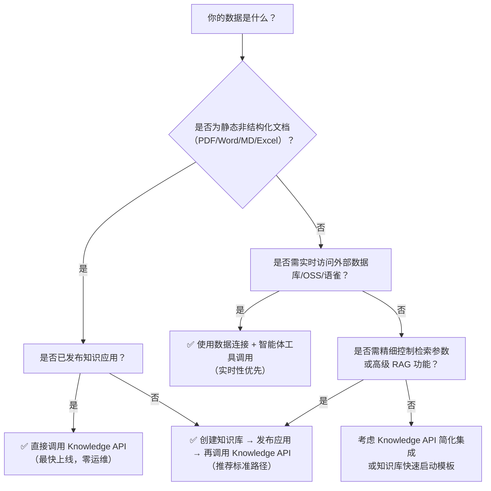

# 知识集成方案对比：Knowledge API、知识库与数据连接

## 概述

在百炼平台构建 RAG（[检索增强生成](../concepts/rag.md)）应用时，开发者需根据数据形态、实时性要求、集成复杂度及业务目标，选择最适配的知识集成方案。当前平台提供三类核心能力：**Knowledge API**（面向服务调用的轻量级知识增强接口）、**知识库**（面向私有文档/非结构化数据的全生命周期 RAG 解决方案）与**数据连接**（面向外部动态数据源的统一接入通道）。本页旨在从技术实现、使用约束、成本模型与适用场景等维度进行系统性对比，为开发者提供清晰、可落地的技术选型参考。

---

## 关键维度对比

| 维度 | Knowledge API | 知识库 | 数据连接 |
|------|----------------|----------|------------|
| **定位与本质** | 面向已发布知识应用的**标准化问答/检索服务接口**，是知识库能力的**生产级封装与对外暴露层** | 百炼平台原生 RAG 核心能力，支持私有文档/非结构化数据的**解析→切片→向量化→索引→检索→问答**全链路管理 | 外部异构数据源（数据库、OSS、语雀、表格文件等）的**安全接入与统一抽象层**，为 RAG 或智能体提供实时/准实时数据供给 |
| **输入格式** | 纯文本 `query`（必需）；支持 `top_k`、`stream`、`app_id` 等控制参数 | 支持 PDF/DOCX/MD/TXT/Excel/CSV 等数十种格式；上传后由平台自动解析、分块、向量化；支持自定义元信息抽取规则 | • 平台托管型：PDF/Word/Excel/CSV/Markdown 等文件 • 流处理型：MySQL/PostgreSQL/PolarDB-X 表结构、OSS Bucket、语雀知识库等；**不接受原始文件上传，仅接入已有数据源** |
| **输出格式** | • 检索：JSON 数组，含 `text`、`score`、`metadata` 字段的 chunk 列表 • 问答：SSE 流式响应，严格按 `plan` → `tool_call` → `answer` 三阶段事件推送，含引用溯源锚点 | • 检索：同 Knowledge API 检索输出（底层一致） • 问答：Web UI 可视化结果 + 完整 SSE 流（含规划步骤、工具调用详情、最终答案及引用高亮） | • 文件/表格连接器：返回匹配的原始文件片段或结构化行数据（JSON） • 数据库连接器：SQL 查询结果集（JSON 数组） • 不提供语义重排或大模型生成，**纯数据层输出** |
| **支持模型** | • 仅限绑定 `app_id` 对应知识应用所配置的模型 • 实际生效模型由应用发布时指定（如 `qwen3.7-plus`），不可运行时切换 | • 兼容所有百炼预置模型（Qwen 系列、DeepSeek-R1、Llama3.1、Yi-Large 等）及用户自定义微调模型 • 向量化（`text-embedding-v4`）、重排序（`qwen3-rerank`）、路由（`qwen-plus`）与生成模型可独立配置 | • **不直接调用大模型** • 作为数据源被知识库、智能体或工作流节点调用；模型选择由上层组件决定（如知识库问答节点中配置的生成模型） |
| **API 端点** | • 检索：`POST https://{workspaceId}.cn-beijing.maas.aliyuncs.com/api/v1/indices/knowledge/search` • 问答：`POST https://{workspaceId}.cn-beijing.maas.aliyuncs.com/api/v2/apps/knowledge/chat` | • 全生命周期管理：`/api/v1/knowledge_bases/...`（创建、上传、索引、删除） • 检索：`/api/v1/knowledge_bases/{kb_id}/search` • 问答：需通过应用 ID 调用 Knowledge API（即复用上一行端点） | • 连接器管理：`/api/v1/connectors/...` • 数据调用：无统一 RESTful 端点；依赖智能体内置工具（如 `searchTableData`）或工作流节点触发，**不开放直连 API** |
| **计费方式** | • 按调用次数计费（QPS） • **不单独收取知识库规格费**，但问答请求会触发关联知识库的向量化、重排、生成等模型调用，产生对应 [Token](../concepts/token.md) 费用 | • **双轨计费**： – 规格费：按知识库版本（标准版/旗舰版）收取小时费用，含存储与 QPS 配额 – 模型费：每次检索/问答均产生 `text-embedding-v4`、`qwen3-rerank`、`qwen-plus`（路由）、`qwen3.7-plus`（生成）等 [Token](../concepts/token.md) 消耗，**多库叠加计费** | • **无连接器本身费用** • 仅消耗调用方模型的 [Token](../concepts/token.md)（如智能体使用 `searchMySQL` 工具后，由后续大模型生成答案产生的费用） • 数据源侧（如 OSS、DMS、PolarDB-X）按各自云产品计费 |
| **典型场景** | • 快速对接第三方系统，需低延迟、标准化问答接口 • 已完成知识库建设与应用发布的 SaaS 厂商，对外提供“知识即服务”（KaaS）能力 • 需要严格控制调用链路（如审计日志、流式阶段解析）的合规场景 | • 构建企业内部知识助手（如 HR 政策问答、IT 运维手册检索） • 需要精细化控制检索参数（相似度阈值、TopK、标签过滤、权重分配）的垂直领域应用 • 要求多轮对话改写、拒答、防泄漏、引用溯源等生产级 RAG 功能 | • 实时查询业务数据库（如订单状态、库存余额） • 接入企业文档中心（OSS）、协作平台（语雀）或本地 Excel 表格，实现“数据即知识” • 构建混合 RAG：知识库处理历史文档 + 数据连接处理实时数据 |

---

## 适用场景建议

### ✅ 选择 **Knowledge API** 当：
- 你已通过控制台完成知识库创建、文档上传、索引构建与应用发布（`app_id` 已就绪）；
- 目标是为外部系统（如客服工单系统、CRM 前端）提供稳定、可监控、带流式阶段语义的问答能力；
- 需要最小化集成成本，避免管理知识库生命周期，仅消费已发布的服务能力；
- 对响应时序有强要求（如必须区分规划、工具调用、生成三阶段用于前端渲染）。

### ✅ 选择 **知识库** 当：
- 数据主体是非结构化文档（PDF/Word/合同/手册），且需平台自动完成解析、分块、向量化与语义索引；
- 要求深度定制 RAG 行为：如设置多知识库权重、启用多轮对话改写、基于 Meta 信息精准过滤、调整相似度阈值与召回数量；
- 需要完整可观测性：SLS 日志包含 `pipeline_id`、`score`、`metadata` 等全链路字段，便于效果分析与问题定位；
- 业务对知识时效性要求不高（T+1 更新即可），更关注准确性、专业性与引用可追溯性。

### ✅ 选择 **数据连接** 当：
- 数据源是动态变化的结构化数据（如 MySQL 订单表、PostgreSQL 用户画像），必须实时查询而非快照；
- 需要接入企业已有数据基础设施（OSS 文档仓库、语雀团队知识库、PolarDB-X 分布式数据库），避免数据迁移；
- 场景本质是“查数据”而非“答问题”——例如：“查张三最近三笔订单”，而非“解释退货政策”；
- 计划构建复合型智能体：知识库处理静态制度文档 + 数据连接获取实时业务数据 + 工作流编排逻辑。

---

## 技术选型决策树（面向开发者）

> **关键提醒**：
> - **Knowledge API 不是独立知识能力，而是知识库的“服务出口”**：未发布知识库的应用无法调用 `/knowledge/chat`，`app_id` 必须存在且关联有效知识库。
> - **知识库与数据连接可协同使用**：例如，在工作流中先用数据连接查出客户 ID，再用该 ID 作为关键词注入知识库检索，实现“动态上下文驱动的精准文档召回”。
> - **地域强约束**：三者均**仅支持华北2（北京）地域**，跨地域部署需同步规划网络与资源。

---  
*最后更新：2025年4月*

## 被对比主题页

- [knowledge](../api/knowledge.md)
- [knowledge base](../guides/knowledge-base.md)
- [data connection overview](../guides/data-connection-overview.md)

