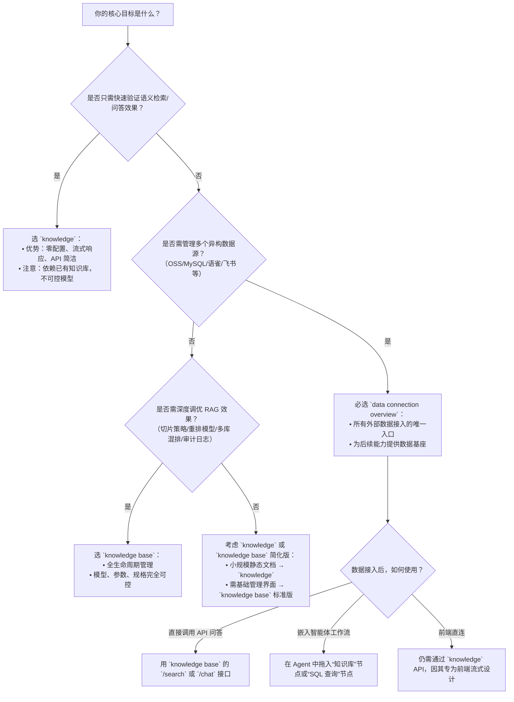

# 知识管理方案对比：Knowledge vs Knowledge Base vs Data Connection Overview

## 概述

本文档面向百炼平台开发者，旨在清晰区分三种核心知识管理能力的定位、技术边界与适用场景：  
- **`knowledge`**：面向快速集成的**语义检索与端到端流式问答 API 服务**，聚焦“即用即查”，不暴露底层索引或模型控制权；  
- **`knowledge base`**：面向精细化 RAG 工程的**可配置、可扩展、可监控的知识库系统**，提供全生命周期管理（创建→解析→索引→检索→重排→计费）；  
- **`data connection overview`**：面向数据接入层的**统一外部数据源抽象与安全桥接能力**，解决“数据从哪来、如何进、怎样管”的问题，是知识库与 [knowledge](../api/knowledge.md) 能力的数据底座。

三者并非互斥替代关系，而是构成典型的**分层协作架构**：  
`Data Connection` 提供数据输入通道 → `Knowledge Base` 构建结构化、可检索的知识资产 → `knowledge` API 提供开箱即用的业务级服务能力。  
本对比旨在帮助开发者根据项目阶段（MVP 验证 / 生产部署 / 多源治理）、技术诉求（低代码 / 高可控 / 强集成）和运维要求（自助配置 / 平台托管 / 权限隔离）做出精准选型。

---

## 关键维度对比表

| 维度 | `knowledge` | `knowledge base` | `data connection overview` |
|------|-------------|------------------|----------------------------|
| **本质定位** | **业务就绪型 API 服务**：封装完整的 RAG 推理链（规划→检索→生成），开箱即用 | **RAG 基础设施平台**：提供知识库创建、索引构建、参数调优、效果监控等全栈能力 | **数据接入网关**：统一纳管外部异构数据源（文件/OSS/数据库/语雀等），为上层提供标准化数据供给 |
| **输入格式** | 仅支持文本 query（如 `"如何申请API Key？"`）；依赖**已发布**的知识库作为隐式数据源 | 支持多模态原始数据： • 非结构化：PDF/DOCX/MD/PNG/JPG/MP4/MP3 • 结构化：CSV/XLSX（含图像 URL 字段） • 实时数据：MySQL/PostgreSQL/PolarDB-X 的元数据或 SQL 查询结果 | 支持多种数据源类型： • 平台托管：本地上传文件、Excel 表格 • 流处理：OSS Bucket、MySQL、PostgreSQL、PolarDB-X、语雀知识库、飞书文档（需配置） |
| **输出格式** | • 检索接口：JSON 数组，含 `content`, `source`, `score` 等字段的文本切片 • 问答接口：SSE 流式事件（`plan`/`tool_call`/`answer`），最终拼接为完整回答 | • 检索结果：JSON 对象，含 `chunks`（带元数据、相似度、来源路径）、`rerank_scores` 等 • 问答结果：同步 JSON 或流式 SSE（取决于应用配置），内容经重排序与 LLM 生成 | 无直接输出；作为数据源被其他能力调用： • 被 `knowledge base` 用于构建索引 • 被 `knowledge` 间接使用（因 [knowledge](../api/knowledge.md) 依赖已发布的知识库） • 被智能体工作流直接调用 `sql_query` 或 `knowledge_retrieval` 工具 |
| **支持模型** | **不支持显式指定模型**；底层由平台固定调度 RAG 专用推理栈（含向量模型 + 重排模型 + 生成模型），开发者不可见、不可替换 | **完全可选配**： • 向量模型：`text-embedding-v4`（默认）等 • 重排模型：`qwen3-rerank`, `qwen3-vl-rerank` 等 • 生成模型：`qwen3.7-plus`, `qwen2.5-turbo`, `deepseek-r1`, `llama3.1-70b` 等数十种预置/自定义模型 | **不直接调用模型**；但不同连接器对模型有隐式要求： • 文件/OSS 连接器启用 Qwen-VL 解析 → 需搭配多模态模型（如 `qwen-vl-plus`） • 数据库连接器执行 SQL → 需模型支持 `sql_query` 工具调用能力 |
| **API 端点** | • 检索：`POST https://{workspaceId}.cn-beijing.maas.aliyuncs.com/api/v1/indices/knowledge/search` • 问答：`POST https://{workspaceId}.cn-beijing.maas.aliyuncs.com/api/v2/apps/knowledge/chat` | • SDK 主要入口：`CreateIndex`, `ListIndices`, `SearchIndex`, `QueryIndex` 等 OpenAPI • 控制台 REST 接口：`/v1/knowledge_bases/{kb_id}/search`（需鉴权） | • 无独立业务 API；所有操作通过控制台或 SDK 的 `CreateConnector`, `ImportFile`, `SyncDataSource` 等管理类接口完成 • 数据访问由上层能力（如 [knowledge](../api/knowledge.md) base）触发，不暴露直连端点 |
| **计费方式** | **按调用量计费**： • 检索请求：0.001 元/次（含向量+关键词双路召回） • 问答请求：按实际消耗 [Token](../concepts/token.md) 计费（含规划、检索、生成各阶段 [Token](../concepts/token.md)） • **无知识库规格费** | **双重计费**： 1. **知识库规格费**：标准版 0.03 元/小时；旗舰版按 RCU（0.2 元/RCU/小时） 2. **模型调用费**：向量（`text-embedding-v4`）、重排（`qwen3-rerank`）、生成（`qwen3.7-plus`）均按 [Token](../concepts/token.md) 单独计费；**重排费用基于初步召回总切片数** | **按数据源类型与用量计费**： • 文件/OSS 连接器：免费（含 1 TB 平台存储额度） • 数据库连接器：DMS 同步流量费 + RDS/PolarDB-X 实例自身费用 • 语雀连接器：语雀 API 调用费（由语雀侧收取） • **不单独收取“连接器”费用**，但数据导入/同步可能触发下游知识库构建费用 |
| **典型场景** | • 客服对话机器人快速上线（无需管理知识库生命周期） • 内部知识助手 MVP 验证（5 分钟接入，验证语义检索效果） • 需要 SSE 流式响应的 Web 应用前端集成 | • 金融/医疗等强合规场景：需精细控制切片策略、相似度阈值、标签过滤、审计日志 • 多知识库联合检索（如“合同库+法规库+案例库”混排） • 需 A/B 测试不同重排模型或生成模型的效果 • 需定时同步（分钟级）外部文档更新 | • 统一纳管企业散落各处的数据：OSS 中的 PDF 报告、MySQL 中的客户信息、语雀中的 SOP 文档 • 构建跨源知识图谱：将表格数据（客户表）与文档数据（服务协议）关联注入同一知识库 • 实现“数据变更 → 自动触发知识库更新”的闭环（如 OSS 新增文件 → 触发知识库增量索引） |

---

## 适用场景建议（面向开发者）

| 项目阶段与需求 | 推荐方案 | 关键理由 |
|----------------|----------|----------|
| **快速验证 RAG 效果（1–3 天 MVP）** | ✅ `knowledge` | 无需创建知识库、无需配置解析策略、无需理解向量/重排概念；只需 workspaceId + API Key + 已发布的知识库，即可调用检索/问答 API，最快 10 分钟跑通端到端流程。适合产品、运营同学主导的可行性验证。 |
| **生产环境部署，需高可用、可审计、可调优** | ✅ `knowledge base` | 提供完整的可观测性（检索日志、耗时分布、召回率统计）、细粒度参数控制（TopK、相似度阈值、混排模型）、多版本知识库灰度发布、RCU 弹性扩缩容，满足 SLA 要求与合规审计需求。 |
| **数据源分散、格式多样、需统一纳管与自动同步** | ✅ `data connection overview` | 是 `knowledge base` 和 `knowledge` 的**前置必要条件**。当你的数据在 OSS、MySQL、语雀、钉钉等多个系统中时，必须先通过[数据连接](../concepts/data-connection.md)器完成接入、分类、权限管控，才能被上层知识能力消费。不选它，其他两者无法发挥价值。 |
| **需要混合使用结构化与非结构化数据** | ✅ `data connection overview` + `knowledge base` | 单独使用 `knowledge` 或纯 `knowledge base` 无法原生支持“SQL 查询 + 文档检索”联合推理。必须通过[数据连接](../concepts/data-connection.md)器分别接入 MySQL（建表）和 OSS（存 PDF），再在同一个知识库中配置“结构化字段过滤”与“多模态解析”，最后由 `knowledge base` 的混排能力融合结果。 |
| **仅需简单文档问答，且数据量小、更新不频繁** | ⚠️ 可选 `knowledge`（轻量）或 `knowledge base`（自主） | 若追求极简，`knowledge` 足够；若需未来扩展（如加标签、改切片、换模型），则 `knowledge base` 更可持续。避免为 10 页 PDF 单独建复杂[数据连接](../concepts/data-connection.md)器。 |
| **需实时查询数据库并生成自然语言回答** | ✅ `data connection overview`（MySQL/PostgreSQL） + `knowledge base`（启用 SQL 工具） | `knowledge` 不支持 SQL；纯 `data connection` 不生成答案。必须组合：用数据连接器接入数据库 → 在知识库中启用 `sql_query` 工具 → 由知识库问答接口调用该工具并融合结果。 |

---

## 技术选型决策树（开发者速查）

> **重要提醒**：  
> - `knowledge` 与 `knowledge base` **均严格限定于华北2（北京）地域**，国际站用户需注意区域适配。  
> - 所有方案均**强制要求业务空间（workspaceId）与有效 API Key**，权限需授予 `AliyunBailianDataFullAccess` 或更细粒度策略。  
> - `data connection` 是能力基石，但**不产生直接业务价值**；它的价值体现在 `knowledge base` 的丰富度与 `knowledge` 的准确性上。请勿跳过此层直接构建上层能力。  

---  
*最后更新：2024年10月*  
*本文档依据百炼平台 v3.7.x 版本功能编写，具体以控制台最新说明及 OpenAPI 文档为准。*

## 被对比主题页

- [knowledge](../api/knowledge.md)
- [knowledge base](../guides/knowledge-base.md)
- [data connection overview](../guides/data-connection-overview.md)

