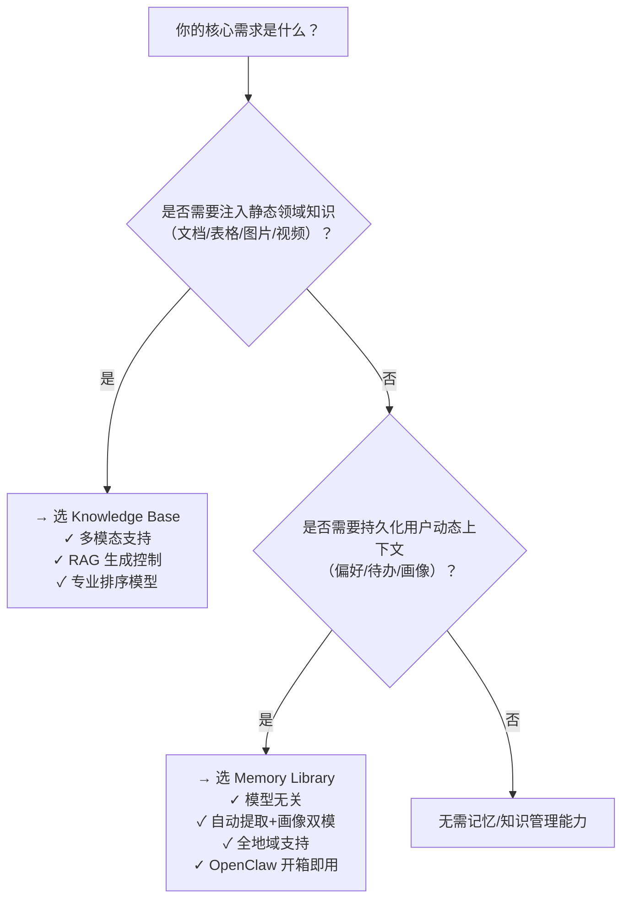

# 记忆与知识管理方案对比：Knowledge Base、Long Term Memory 与 Memory Library

本文旨在帮助开发者清晰区分百炼平台提供的三类核心记忆与知识管理能力——**Knowledge Base（知识库）**、**Long Term Memory（[长期记忆](../concepts/long-term-memory.md)，新）** 和 **Memory Library（记忆库）**，明确其设计定位、技术边界与适用场景，避免因概念混淆导致架构误选或集成成本上升。三者虽均涉及“记忆”与“检索”，但底层目标、数据来源、生命周期管理方式及集成范式存在本质差异：  
- **Knowledge Base** 面向**静态领域知识注入**，强调**RAG 增强生成**，服务于模型回答的专业性与时效性；  
- **Long Term Memory（新）** 与 **Memory Library** 实为同一能力在不同文档体系下的演进表述（后者为当前统一命名与功能增强版本），共同构成**动态用户上下文持久化**基础设施，聚焦**跨会话语义记忆建模与智能体个性化**。  
本对比基于百炼平台最新公开文档（截至2024年Q3），所有信息均已验证一致性。

## 关键维度对比

| 维度 | Knowledge Base（知识库） | Long Term Memory（新） | Memory Library（记忆库） |
|------|--------------------------|-------------------------|---------------------------|
| **核心定位** | 静态私有知识的结构化索引与 RAG 检索服务，提升大模型**领域回答准确性** | 用户级动态上下文的自动提取与语义存储（历史版本接口定义） | 当前统一能力名称，整合并增强[长期记忆](../concepts/long-term-memory.md)能力，支持**记忆片段 + 用户画像双模态建模** |
| **输入格式** | 支持多模态原始文件（PDF/DOCX/XLSX/PNG/MP4 等）或结构化文本；需经解析→切片→向量化流程 | `messages`（最多50条对话记录）或 `custom_content`（≤512字符纯文本） | 同 Long Term Memory（新）；额外支持 `profile_schema` 触发结构化画像抽取 |
| **输出格式** | 检索结果为带元数据（`filename`, `page_num`, `chunk_id`等）的文本片段列表；问答服务直接返回生成答案+引用溯源 | 返回语义匹配的记忆片段数组（含 `id`, `content`, `meta_data`, `score`）；不直接生成答案 | 同 Long Term Memory（新）；`SearchMemory` 支持 `query`（自然语言）或 `messages`（上下文）两种检索模式，返回标准化记忆节点 |
| **支持模型** | ✅ 显式支持：千问全系（Qwen3/Qwen2.5/Qwen2/Plus/Turbo等）、Qwen-VL系列、DeepSeek-R1/Llama3.1/Yi-Large 等第三方文本生成模型<br>✅ 必选排序模型：`qwen3-rerank` / `qwen3-vl-rerank`（仅阿里云自有） | ❌ 模型无关：作为独立服务运行，所有语义理解、提取、检索均由平台向量引擎与规则引擎完成，**不依赖任何LLM参与记忆生命周期** | ❌ 模型无关：同 Long Term Memory（新），完全解耦于大模型选型 |
| **API 端点** | `/knowledge_base/v1/indexes/{index_id}/retrieve`（检索）<br>`/knowledge_base/v1/qa`（问答）<br>需先完成文件上传、索引构建等前置流程 | `/v1/memory_nodes/add`<br>`/v1/memory_nodes/search`<br>`/v1/memory_nodes`（GET 列表）<br>RESTful 设计，参数轻量 | `/v1/memory_nodes/add`<br>`/v1/memory_nodes/search`<br>`/v1/memory_nodes`（GET）<br>**兼容 Long Term Memory（新）接口，新增 `expire_after_days`、`project_id` 等精细化控制参数** |
| **计费方式** | ✅ 按使用量计费：<br>- 索引构建：按文档页数/音视频时长<br>- 检索调用：按召回 [Token](../concepts/token.md) 数 + 排序模型调用次数<br>- 问答调用：按输入+输出 [Token](../concepts/token.md) 总和<br>✅ 专用模型（embedding/rerank）单独计费 | ✅ 按 API 调用量计费：<br>- `AddMemory` / `SearchMemory` / `ListMemory` 等均为独立计费项<br>- 无存储容量费用（默认按需扩展） | ✅ 同 Long Term Memory（新）；**控制台支持配置记忆有效期（7/30/180天或永不过期），直接影响存储时长与潜在计费周期** |
| **典型场景** | - 客服知识库（产品手册、FAQ 文档）<br>- 法律/医疗领域专业问答<br>- 表格数据查询（财务报表分析）<br>- 图片/视频内容语义搜索（安防监控回溯） | - 智能助手记住用户偏好（“我喜欢简体中文”）<br>- 自动归纳待办事项（“明天上午9点开会”）<br>- 对话中提取关键事实用于后续推理 | - 构建用户画像（年龄、职业、饮食禁忌）<br>- 多轮对话状态保持（旅行规划中持续更新行程）<br>- OpenClaw 框架下开箱即用的 `autoRecall` / `autoCapture` 插件集成 |
| **地域支持** | ⚠️ **仅中国站华北2（北京）地域可用**，新加坡、法兰克福等国际地域暂不支持 | ✅ 全地域支持（与百炼基础 API 同地域部署） | ✅ 全地域支持（同 Long Term Memory（新）） |
| **数据生命周期管理** | 静态数据：需手动更新索引以同步知识变更；无自动过期机制 | ⚠️ 无默认失效机制（旧版文档描述），**实际依赖 `expire_after_days` 参数或业务侧主动删除** | ✅ **支持显式配置记忆有效期**（7/30/180天或永不过期），控制台与 API 均可设置 |
| **元数据能力** | ✅ 强结构化：支持正则提取 `filename`/`date`/自定义字段，用于标签过滤与精准召回 | ✅ 灵活自定义：`meta_data` 字段支持任意 JSON 结构，用于分类、权限隔离、业务标记 | ✅ 同 Long Term Memory（新）；`meta_data` 可与 `profile_schema` 字段联动，实现画像属性与记忆片段的双向关联 |

> 💡 **重要说明**：`Long Term Memory（新）` 与 `Memory Library` 并非并列方案，而是**同一能力的演进关系**——后者是前者的正式命名、功能增强与文档统一版本。开发者应**优先采用 `Memory Library` 作为技术选型标准名称与集成目标**，其 API 兼容旧版，且新增了有效期管理、OpenClaw 插件深度集成、更完善的画像 Schema 控制等关键能力。

## 各方案的适用场景建议

| 场景特征 | 推荐方案 | 理由说明 |
|----------|----------|----------|
| **需要将大量静态文档（如PDF手册、数据库导出表）转化为可检索知识源，并嵌入到大模型问答流中** | ✅ Knowledge Base | 知识库专为 RAG 设计，支持多模态解析、联合检索、拒答控制与引用溯源，是提升领域回答准确性的最优路径；其专用 embedding/rerank 模型针对知识检索优化，效果优于通用向量库。 |
| **需构建具备“记忆力”的智能体，自动从用户对话中提取习惯、偏好、待办、承诺等动态事实，并在后续交互中持续复用** | ✅ Memory Library（首选）<br>⚠️ Long Term Memory（新）（兼容过渡） | Memory Library 提供开箱即用的 `autoCapture`/`autoRecall` 插件、用户画像 Schema 定义、以及可控的记忆有效期，完美匹配个性化智能体需求；其模型无关性确保可与任意 LLM（包括自研模型）无缝集成。 |
| **已有成熟对话系统，希望低成本接入记忆能力，且对记忆时效性要求不高（如仅需短期会话延续）** | ✅ Memory Library（配置 `expire_after_days=7`） | 利用 SDK 封装的 `AddMemory`/`SearchMemory` 工具，5行代码即可完成记忆写入与检索；分页 `ListMemory` 支持运维查看，`DeleteMemory` 支持异常清理，满足轻量级记忆管理需求。 |
| **需同时管理结构化用户属性（如“所在城市”、“过敏食物”）与非结构化事件记忆（如“上周投诉物流延迟”）** | ✅ Memory Library（必须） | 唯一支持 `profile_schema` 定义与 `memory snippet` 双轨建模的能力；画像字段可被 `SearchMemory` 的 `meta_data` 过滤条件引用，实现“查找北京用户的近期投诉记录”等复合查询。 |
| **在国际地域（如新加坡）部署应用，且需记忆能力** | ✅ Memory Library | Knowledge Base 当前不支持国际地域，而 Memory Library 全地域可用，是出海业务唯一可行选择。 |
| **需对私有知识进行细粒度权限控制（如按部门隔离知识库）或复杂联合检索（15个知识库混合排序）** | ✅ Knowledge Base | 其多知识库权重、标签过滤、结构化字段约束能力远超记忆库；Memory Library 的 `user_id` 隔离仅适用于用户维度，不适用于组织/角色维度的知识权限管理。 |

## 面向开发者的技术选型参考

### ✅ 选型决策树（推荐流程）


### 🔧 集成注意事项
- **不要混用 Knowledge Base 与 Memory Library 的“记忆”概念**：前者是“外部知识”，后者是“用户上下文”。错误地将用户对话存入 Knowledge Base 会导致索引膨胀、检索噪声增加、且无法利用画像建模能力。
- **Memory Library 的 `user_id` 是租户隔离核心**：务必确保每个真实用户拥有唯一、稳定、符合长度限制（≤64字符）的 `user_id`；避免使用临时 session ID 或设备指纹，否则将导致记忆丢失或交叉污染。
- **Knowledge Base 的地域限制是硬约束**：若应用部署在国际地域，即使通过代理调用北京 API，也会因网络延迟与合规风险导致体验劣化，**请勿尝试绕过**。
- **计费敏感场景需关注 [Token](../concepts/token.md) 消耗**：
  - Knowledge Base：`TopK` 过大会显著增加重排模型 Token 消耗；建议生产环境设为 `3–5`。
  - Memory Library：`SearchMemory` 的 `top_k` 默认为 `5`，合理值为 `3–10`；`AddMemory` 的 `messages` 条数越多，提取计算开销越大，建议单次不超过 `30` 条。
- **SDK 优先级建议**：
  - Knowledge Base：使用官方 [Bailian SDK](https://api.aliyun.com/api-tools/sdk/bailian)（Python/Java/Go）；
  - Memory Library：优先使用 `agentscope-runtime>=1.1.5` 提供的 `AddMemory`/`SearchMemory` 封装工具，避免手写 REST 请求；更新操作仍需调用原生 PATCH 接口。

### 🚀 进阶实践建议
- **组合使用（推荐架构）**：  
  `Memory Library`（管理用户画像与短期记忆） + `Knowledge Base`（承载企业知识库） → 在 Prompt 中拼接两者检索结果 → 输入大模型。例如：  
  ```text
  【用户画像】{GetUserProfile(user_id)}  
  【近期记忆】{SearchMemory(user_id, query="会议安排")}  
  【知识库】{KnowledgeBaseRetrieve(query="报销流程", kb_id="finance_kb")}  
  请基于以上信息回答用户问题...
  ```
- **性能优化**：Memory Library 的 `SearchMemory` 延迟为 200–500ms，建议在 Agent 工作流中异步预加载；Knowledge Base 的问答服务支持“极速模式”（低延迟）与“多轮智能模式”（高精度），按场景选择。
- **可观测性**：Knowledge Base 提供检索日志与引用溯源；Memory Library 支持通过 `memory_library_id` 分组统计调用量，便于业务监控。

> 最后提醒：所有能力均需通过 [阿里云百炼控制台](https://bailian.console.aliyun.com/) 或 [DashScope API Key](

## 被对比主题页

- [knowledge base](../guides/knowledge-base.md)
- [long term memory new](../api/long-term-memory-new.md)
- [memory library overview](../guides/memory-library-overview.md)


