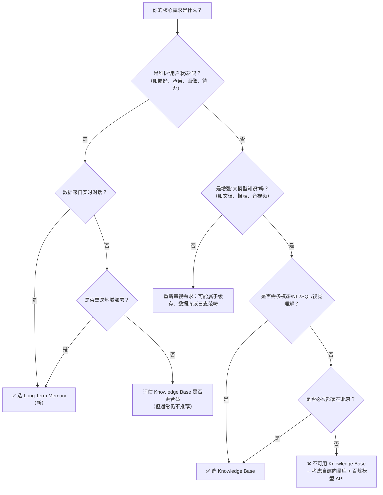

# [长期记忆](../concepts/long-term-memory.md)与知识库方案对比：Long Term Memory、Knowledge Base 与 Memory Library Overview

## 背景与目的  
在百炼平台构建智能体（Agent）或增强型应用时，开发者常需解决两类核心信息管理问题：  
- **用户侧长期状态维护**：如跨会话记住用户偏好、习惯、承诺事项、身份属性等个性化上下文；  
- **系统侧领域知识注入**：如将企业文档、产品手册、客服知识库等私有数据赋能大模型，提升回答专业性与准确性。  

“Long Term Memory（[长期记忆](../concepts/long-term-memory.md)，新）”、“Knowledge Base（知识库）”和“Memory Library Overview（记忆库概览）”三者名称相近、能力部分重叠（均支持语义检索），但设计目标、数据来源、生命周期与集成方式存在本质差异。本文旨在为开发者提供清晰、可落地的技术选型参考，避免因概念混淆导致架构误用、性能瓶颈或功能缺失。

---

## 关键维度对比表

| 维度 | Long Term Memory（新） | Knowledge Base（知识库） | Memory Library Overview（记忆库概览） |
|------|------------------------|---------------------------|----------------------------------------|
| **核心定位** | **用户级结构化状态持久化**：聚焦“谁说了什么、承诺了什么、偏好是什么”，强调用户画像与对话事件建模 | **系统级领域知识增强**：聚焦“文档/数据里有什么”，为大模型注入外部事实性知识，支撑 RAG 场景 | **[长期记忆](../concepts/long-term-memory.md)能力的统一抽象与演进视图**：非独立服务，而是对 `Long Term Memory（新）` 功能集的整合性描述与使用指南，涵盖 API、插件、控制台等全链路体验 |
| **输入格式** | • `messages`：多轮对话数组（≤50 条） • `custom_content`：纯文本（≤512 字符） • `meta_data`：键值对元数据 | • 多格式文件：PDF/DOCX/PPTX/TXT/Markdown/HTML/XLSX/CSV/PNG/JPG/MP3/MP4 等 • 支持视觉理解（VL）、语音识别（ASR）、NL2SQL、帧提取等解析能力 | 同 *Long Term Memory（新）*（二者为同一底层服务） |
| **输出格式** | • `SearchMemory` 返回结构化记忆片段列表，含 `content`、`score`、`meta_data`、`memory_node_id` • `GetUserProfile` 返回 Schema 化用户画像对象 | • 检索接口返回切片列表，含 `text`、`score`、`metadata`、`file_name`、`page_number` 等 • 问答接口返回自然语言答案 + 引用溯源 | 同 *Long Term Memory（新）* |
| **支持模型** | • **不绑定特定大模型**：作为独立状态服务，供任意模型（Qwen、Llama、DeepSeek 等）调用其结果注入提示词 • 自动提取逻辑由百炼专用记忆模型完成 | • **深度集成大模型推理流**：   - 预置模型：Qwen3/Qwen2.5/Qwen2/Long/Max/Plus/Turbo/VL-Max/OCR 等全系千问   - 第三方模型：DeepSeek-R1/V3.1、abab6.5s、Llama3.1、Yi-Large 等   - 自定义微调模型（需 Model Studio 训练） | 同 *Long Term Memory（新）*（不绑定模型，但 OpenClaw 插件默认适配 Qwen 系列） |
| **API 端点（Base URL）** | `https://dashscope.aliyuncs.com/api/v2/apps/memory/` （`/add`, `/search`, `/list`, `/update`, `/delete`, `/profile`） | `https://dashscope.aliyuncs.com/api/v1/indices/rag/index/retrieve`（仅文档类知识库开放 API） 其他能力（如问答、NL2SQL）通过工作流节点或控制台服务调用 | 同 *Long Term Memory（新）*（API 完全一致） |
| **计费方式** | • **按调用量计费**：   - `AddMemory`：按写入条数计费   - `SearchMemory` / `ListMemory`：按检索/查询次数计费   - `UpdateMemory` / `DeleteMemory`：按操作次数计费 • 无存储容量费用（自动清理策略） | • **按 RCU（Retrieval Compute Unit）计费**：   - 1 RCU ≈ 50 QPS（标准版固定 1 QPS，旗舰版 1–200 RCU 可选）   - 存储按实际占用量计费（文档解析后向量+元数据）   - 索引构建、Rerank、Query 改写等高级能力计入 RCU 消耗 | 同 *Long Term Memory（新）*（计费模型完全一致） |
| **地域支持** | 全地域可用（华北2、华东1、华南1、新加坡、法兰克福等） | **仅限华北2（北京）地域**，国际地域不可用 | 全地域可用（继承自 Long Term Memory） |
| **典型场景** | • 智能客服中记住用户历史投诉与解决方案 • 个人助理中持续跟踪“帮我订下周二会议室”、“提醒我给张三发合同”等待办 • 教育 Agent 中积累学生错题模式与学习风格画像 | • 企业内部知识问答（HR政策、IT SOP 文档） • 金融投顾基于研报/财报生成分析建议 • 医疗助手依据药品说明书与临床指南回答用药问题 • 多模态客服：看图识故障、听音辨设备异响 | • 快速接入 OpenClaw 框架，开箱启用全自动记忆捕获与召回 • 在控制台统一管理多个记忆库、规则与画像模板 • 构建跨应用共享的用户中心化记忆空间 |

> ✅ **关键结论**：`Memory Library Overview` 是对 `Long Term Memory（新）` 的**功能全景说明与最佳实践汇总**，二者技术实现、API、计费完全一致，**不是第三种独立方案**。真正的技术选型是在 **Long Term Memory（新）** 与 **Knowledge Base** 之间做出决策。

---

## 各方案适用场景建议（面向开发者）

### ✅ 选择 **Long Term Memory（新）** 当：
- 你需要**以用户为中心**建模状态：例如 `user_id = "u_12345"` 的饮水习惯、会议偏好、家庭成员关系；
- 数据来源于**实时对话流**（而非静态文档），需从 `messages` 中自动提取事件与属性；
- 要求**强结构化与可编程管理**：如通过 `profile_schema` 定义“职业=工程师、技能标签=[Python, Kubernetes]”，并支持 `UpdateMemory` 增量更新；
- 应用需**跨地域部署**（如服务新加坡用户），且不能受限于华北2；
- 你正在构建 **Agent 框架（如 OpenClaw）**，需要轻量、低延迟、可插拔的状态层（`autoCapture`/`autoRecall` 插件已深度适配）；
- 对**写入/检索延迟敏感**（`AddMemory`: 500–1000ms；`SearchMemory`: 200–500ms），且需保证主流程响应不受影响（自动捕获为异步）。

### ✅ 选择 **Knowledge Base** 当：
- 你的知识源是**静态或半静态的私有资料**：如 PDF 手册、Excel 产品参数、PPT 培训材料、MP4 培训视频；
- 核心目标是**提升大模型回答的专业性与事实准确性**，而非维护用户状态；
- 需要**多模态理解能力**：图文混合文档、音视频内容、表格数据（NL2SQL）；
- 接受**地域限制**（必须部署在北京），且业务对 RCU 弹性扩缩容有明确需求；
- 你采用**工作流编排**（如拖拽式“知识库节点 → 大模型节点”），或依赖控制台一站式配置（标签过滤、Query 改写、混合检索）；
- 需要**大规模并发检索能力**（旗舰版支持最高 10,000 QPS），远超 Long Term Memory 的 300 QPM 限制。

### ⚠️ 不推荐混用或替代的情形：
- ❌ **不要用 Knowledge Base 存储用户对话事件**：它无 `user_id` 隔离、不支持画像 Schema、无法按用户维度 CRUD，且文档上传流程重、延迟高；
- ❌ **不要用 Long Term Memory 替代知识库做 RAG**：它不支持 PDF/Excel/音视频解析，无 NL2SQL、无视觉理解，也无法绑定大模型自动注入检索结果；
- ❌ **不要将 `Memory Library Overview` 视为独立服务选型项**：它是文档视角的整合说明，技术实现即 `Long Term Memory（新）`。

---

## 技术选型决策树（开发者快速自查）

---

## 总结

| 方案 | 本质 | 关键优势 | 关键约束 |
|------|------|----------|----------|
| **Long Term Memory（新）** | 用户状态引擎 | 用户隔离强、对话自动提取、Schema 化画像、全地域、低延迟、OpenClaw 开箱即用 | 写入内容长度受限（≤512 字符/50 条消息）、无文档解析能力 |
| **Knowledge Base** | RAG 知识引擎 | 多格式/多模态支持、NL2SQL、视觉/语音理解、高并发（RCU 弹性）、深度模型集成 | 仅限华北2、文档上传流程重、无用户级状态管理能力 |
| **Memory Library Overview** | 文档视角 | 提供统一入口、最佳实践、插件集成指南、控制台操作指引 | **非独立技术方案，不参与选型决策** |

> 📌 **最后建议**：  
> - 若构建 **用户交互型智能体（Customer-facing Agent）**，优先选用 `Long Term Memory（新）`；  
> - 若构建 **企业知识中枢（Enterprise Knowledge Hub）**，优先选用 `Knowledge Base`；  
> - 无论选择哪一方案，均应通过 [百炼控制台 → 记忆库/知识库](https://bailian.console.aliyun.com) 进行可视化调试与效果验证，并结合 SLS 日志监控 `response_code` 与 `latency` 指标持续优化。

## 被对比主题页

- [long term memory new](../api/long-term-memory-new.md)
- [knowledge base](../guides/knowledge-base.md)
- [memory library overview](../guides/memory-library-overview.md)

