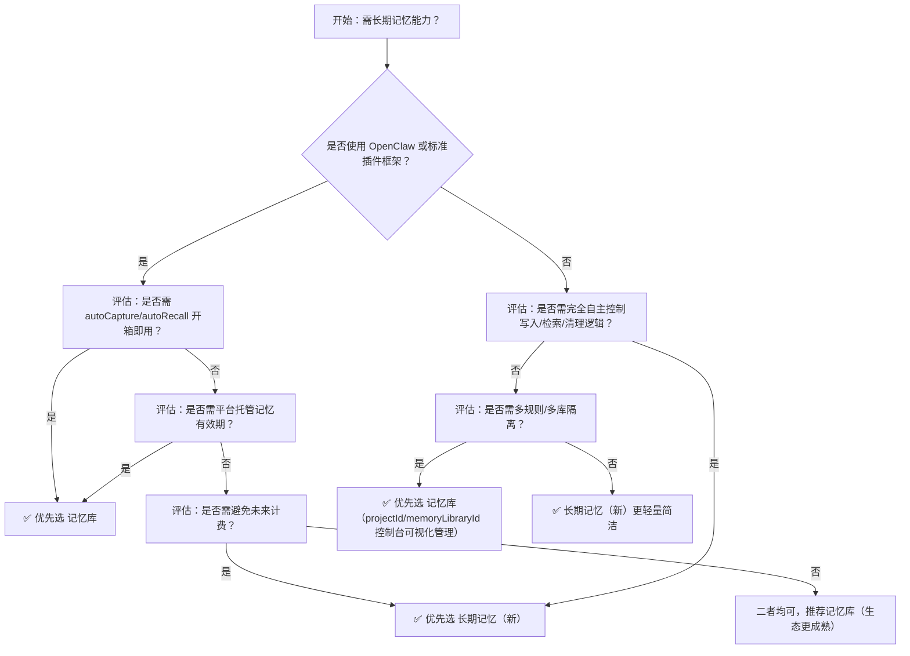

# [长期记忆](../concepts/long-term-memory.md)与记忆库方案对比

本文档旨在帮助开发者清晰区分百炼平台当前并存的两类[长期记忆](../concepts/long-term-memory.md)能力——**[长期记忆](../concepts/long-term-memory.md)（新）**（`long-term-memory-new`）与**记忆库（Memory Library）**，明确其技术定位、能力边界与适用场景。二者虽共享底层架构与核心 API 域名，但在设计目标、功能演进阶段、接口语义、生命周期管理及商业化路径上存在实质性差异。本对比基于 2024 年 Q3 最新文档与实测行为整理，为智能体（Agent）系统架构设计与技术选型提供客观依据。

## 关键维度对比

| 维度 | 长期记忆（新） | 记忆库（Memory Library） |
|------|----------------|---------------------------|
| **定位与演进阶段** | 百炼平台新一代结构化记忆能力，聚焦**强可控性、高一致性与开发者自主权**；API 设计更严谨，参数契约明确，面向自研 Agent 框架深度集成 | 百炼平台面向快速落地的**全栈式记忆解决方案**，强调“开箱即用”，通过[插件](../concepts/plugin.md)（如 OpenClaw [插件](../concepts/plugin.md)）实现自动捕获/召回闭环，兼顾低代码与代码集成 |
| **输入格式** | `AddMemory` 接口支持互斥二选一： • `messages`: role-content 对话数组（最多 50 条，至少含 1 条 `user` 消息） • `custom_content`: 纯文本（≤512 字符） 支持 `profile_schema` 绑定画像模板 | 同样支持 `messages`（自动提取）与 `custom_content`（直接写入），但额外支持 `meta_data` 字段用于业务元数据分类（如 `{"category": "preference", "source": "onboarding"}`） |
| **输出格式** | `SearchMemory` 返回结构化 JSON 数组，每项含 `id`, `content`, `score`, `created_at`, `metadata`（若写入时携带）；字段语义统一、无冗余字段 | `POST /memory_nodes/search` 返回类似结构，但增加 `node_type`（`"memory"` 或 `"profile"`）、`project_id`、`memory_library_id` 等上下文标识字段，便于多规则/多库溯源 |
| **支持模型** | 不依赖特定大模型；记忆提取由平台内置 NLU 模块完成（非调用用户指定模型）；所有接口与模型解耦 | 同样不依赖用户侧模型；但**自动捕获（autoCapture）与自动召回（autoRecall）为异步后台任务**，其提取质量受平台统一模型策略影响，不可替换 |
| **API 端点** | 全量接口统一 Base URL： `https://dashscope.aliyuncs.com/api/v2/apps/memory/` 具体路径：`/add`, `/search`, `/list`, `/delete`, `/update`, `/profile_schemas/*` 等 | 使用**相同 Base URL**，但部分路径语义不同： • 写入：`POST /add`（同长期记忆新） • 检索：`POST /memory_nodes/search`（非 `/search`） • 列表：`GET /memory_nodes`（分页参数为 `page`/`page_size`，非 `offset`/`limit`） • 更新：`PATCH /memory_nodes/{id}`（长期记忆新暂未 SDK 封装） |
| **计费方式** | **当前免费**；官方未公布商业化时间表；适用于开发验证与中小规模生产环境 | **明确商业化路径**：将于 **2026 年 8 月 20 日 10:00（北京时间）起正式计费**；Pro/Lite 版本按调用次数计费（`AddMemory`、`SearchMemory` 等均计费），详见控制台定价页 |
| **数据生命周期管理** | **无自动过期机制**；`user_id` + `memory_library_id` 下所有记忆永久存储，需业务层自行实现 TTL 清理逻辑（如定时调用 `DeleteMemory`） | **支持规则级有效期配置**：在控制台可为每个 `projectId`（记忆片段规则）设置 7 天 / 30 天 / 180 天 / 永不过期；平台自动执行清理，降低运维负担 |
| **画像能力** | 支持 `CreateProfileSchema` / `GetUserProfile`，但 `profile_schema` 仅作为 `AddMemory` 的可选参数，**无独立画像写入接口**；画像数据实际以特殊类型记忆节点存储 | 提供完整画像生命周期：`POST /profile_schemas`（创建）、`PUT /profile_schemas/{id}`（更新）、`GET /profile_schemas/{id}/user_profile`（获取）、`PATCH /profile_schemas/{id}/user_profile`（增量更新）；支持 `autoRecall` 自动注入画像至对话上下文 |
| **SDK 支持成熟度** | `agentscope-runtime>=1.1.5` 提供 `AddMemory`, `SearchMemory`, `ListMemory`, `DeleteMemory` 封装；`UpdateMemory` 需手动构造 PATCH 请求（已知缺口） | 官方[插件](../concepts/plugin.md)（OpenClaw）提供 `memory_search` / `memory_store` / `memory_list` / `memory_forget` 工具函数；`agentscope-runtime` 未提供专属封装，但可复用通用 HTTP 工具类 |
| **典型场景** | • 需要精确控制记忆写入时机与内容结构的自研 Agent • 多租户隔离要求严格（如 SaaS 应用，`user_id` 即租户 ID） • 对记忆时效性有定制策略（如按业务事件触发清理） • 已有成熟画像 Schema 且需强一致性写入 | • 快速构建个性化对话 Agent（如客服、导购） • 希望零配置启用“记住用户偏好”能力 • 使用 OpenClaw 等标准框架，追求最小改造成本 • 需要长期稳定运行且接受平台统一代管生命周期 |

## 各方案的适用场景建议

### ✅ 推荐选用「长期记忆（新）」的场景：
- **架构可控性优先**：团队具备较强的工程能力，希望完全掌控记忆的 CRUD 流程、错误重试、幂等性与事务边界；
- **多租户强隔离需求**：`user_id` 实际代表企业客户或子账户，要求记忆空间绝对隔离，且需审计级日志追踪；
- **混合写入模式**：既需从对话自动提取（如会议纪要摘要），又需人工注入关键业务事实（如订单状态变更），且二者需共用同一 `user_id` 空间；
- **规避未来计费风险**：项目处于 PoC 或早期验证阶段，需确保长期免费使用，暂不规划商业化预算。

### ✅ 推荐选用「记忆库（Memory Library）」的场景：
- **交付效率优先**：产品需在 1–2 周内上线带记忆能力的 MVP，且团队熟悉 OpenClaw 或标准 HTTP 集成；
- **标准化画像管理**：业务已定义清晰用户属性集（如金融 KYC、教育学情），需平台自动完成抽取、聚合与版本管理；
- **跨会话状态延续**：如旅行规划 Agent 需记住“用户偏好靠窗座位”、“过敏食物为花生”，并自动在后续对话中召回；
- **接受平台托管生命周期**：信任百炼平台的稳定性与自动清理能力，不愿自行维护 TTL 调度服务。

### ⚠️ 注意事项（共性约束）
- **认证方式一致**：均需 `Authorization: Bearer $DASHSCOPE_API_KEY`，且**不支持 Coding Plan 的 API Key**；
- **限流策略相同**：账号级总计 ≤3000 QPM；`AddMemory` ≤120 QPM；`SearchMemory` ≤300 QPM；
- **ID 安全规范一致**：`user_id`、`memory_library_id` 等字符串禁止包含 `/`、`?`、`#` 等 URL 不安全字符；
- **非替代关系**：二者并非版本迭代关系（即“记忆库”不是“长期记忆新”的升级版），而是**并行演进、能力互补的两套方案**；同一应用可按模块混合使用（如核心用户画像走记忆库，临时任务记录走长期记忆新）。

## 技术选型决策树（面向开发者）

> **最后建议**：对于新项目，若无强定制需求，**推荐从「记忆库」起步**——利用插件快速验证价值；待业务稳定后，再针对高敏感模块（如金融交易记录）迁移至「长期记忆（新）」以增强可控性。两者共用同一 API 域名与鉴权体系，平滑迁移成本极低。

## 被对比主题页

- [long term memory new](../api/long-term-memory-new.md)
- [memory library overview](../guides/memory-library-overview.md)

