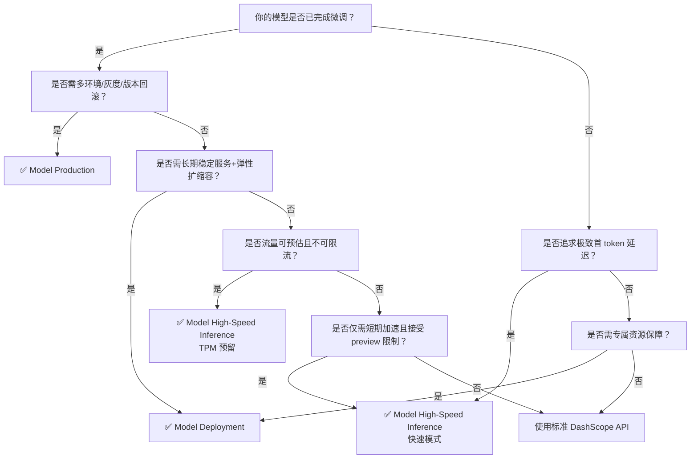

# 模型部署与推理方案对比：Model High-Speed Inference vs Model Deployment vs Model Production

> **目的与背景**  
> 百炼平台提供三类面向不同阶段与目标的模型服务化能力：`Model High-Speed Inference`（高时效性推理加速）、`Model Deployment`（生产级模型服务化）和 `Model Production`（端到端模型生命周期管理）。开发者常因命名相似、功能交叉而混淆其定位，导致选型偏差——例如误用快速模式承载核心业务流量，或在未完成微调时提前申请 PTU 预留。本文旨在从技术本质、能力边界与工程约束三个维度进行结构化对比，帮助开发者基于**业务SLA要求、模型成熟度、流量特征与成本模型**做出精准技术选型。

---

## 关键维度对比表

| 维度 | Model High-Speed Inference | Model Deployment | Model Production |
|------|----------------------------|------------------|------------------|
| **核心定位** | **推理加速层优化**：在已有标准API基础上，叠加容量保障或吞吐提速能力，不改变模型本身 | **服务化层抽象**：将指定模型（预置/LoRA）封装为资源独占、可配置、可观测的专属推理服务 | **全生命周期层编排**：覆盖“微调训练 → 模型注册 → 多环境部署 → 版本灰度”的端到端生产流水线 |
| **输入格式** | 与标准 DashScope API 完全一致（`messages` / `prompt` + `parameters`），无需改造请求体 | 同标准 API；PTU/MU 模式支持额外参数（如 `enable_thinking`, `max_context_length`）；Token 计费模式需匹配基础模型协议 | 同标准 API；但部署后 endpoint 必须携带 `deployment_id`，且请求体需符合该部署绑定模型的微调协议（如特定 system [prompt](../guides/prompt.md) 结构） |
| **输出格式** | 标准响应结构；快速模式额外返回 `reasoning_content` 字段（流式场景需分别处理 `delta.reasoning_content` 和 `delta.content`） | 标准响应结构；MU 模式启用 `thinking` 时可能返回 `reasoning_steps`；PTU 模式无结构变化 | 标准响应结构；无新增字段，但语义行为由微调结果决定（如客服模型自动补全工单编号） |
| **支持模型** | • TPM 预留：Qwen、GLM、DeepSeek、Kimi 等主流模型多版本 • 快速模式：仅 `glm-5.2-fast-preview`（Preview 阶段，地域受限） | • 预置模型：Qwen、DeepSeek、GLM、Kimi、CosyVoice 全系列（文本/多模态/语音/Embedding/Rerank） • 自定义模型：**仅 LoRA 微调模型**（需严格匹配基础模型+rank约束） | • 微调来源：仅支持基于百炼支持的基础模型（如 `qwen2-7b-instruct`）开展监督微调 • 部署来源：微调产出的 `model_id` 或通过 OSS 导入的第三方模型（需满足格式与权限要求） |
| **API 端点** | • TPM 预留：通用 DashScope 域名 `dashscope.aliyuncs.com` + 专属 `model` code（如 `qwen37max-20260520-tpm-xxxx`） • 快速模式：地域专属 MaaS 域名（如 `{workspace_id}.cn-beijing.maas.aliyuncs.com`） + 固定 model ID | 统一 DashScope 域名 `dashscope.aliyuncs.com` + 部署生成的 `deployed_model` ID（如 `qwen-flash-2025-07-28-ptu-12345`） | 统一 DashScope 域名 `dashscope.aliyuncs.com` + `deployment_id`（如 `dep-abc123xyz`），endpoint 路径含 `/services/...?deployment_id=...` |
| **计费方式** | • TPM 预留：预付费（按 kTPM×时长），支持溢出至按量计费 • 快速模式：按 Token 实际用量计费（缓存命中单价明确标注，无折扣逻辑） | • PTU 模式：预付费（按输入/输出 kTPM×时长），支持阶梯系数与缓存折扣 • MU 模式：后付费（按模型单元规格×小时），支持 PD 分离与 Thinking 模式溢价 • Token 计费（`lora`）：按实际输入/输出 Token 数计费（仅限指定基础模型） | • 微调阶段：按 GPU 小时计费（任务运行时长） • 部署阶段：按 `instance_type` 规格×运行时长计费（冷启缩容支持，最小实例数可设为 0） |
| **典型场景** | • TPM 预留：金融风控实时决策、电商大促期间搜索问答服务（流量可预估，不可限流） • 快速模式：AI 编程助手多步代码生成、Agent 执行链中高频子任务（对首 token 延迟敏感） | • PTU：企业知识库问答（长文档摘要+高并发） • MU：定制化客服机器人（需 Thinking 模式+上下文长度控制） • Token 计费：低频但高价值垂类任务（如法律合同关键条款提取） | • 垂直领域模型迭代：银行智能投顾话术微调 → staging 环境AB测试 → prod 灰度发布 • 第三方模型集成：将自研小模型通过 OSS 导入 → 注册为 `model_id` → 部署至多可用区 |
| **扩展性与治理** | 无独立扩缩容能力；TPM 预留容量固定，快速模式依赖排队机制缓解突发 | 支持自动化扩缩容（MU 模式）、RPM/TPM 限流、细粒度监控（延迟/P95/错误率） | 支持多环境部署（staging/prod）、版本回滚、流量灰度（按比例/用户标签）、部署健康度巡检 |
| **模型变更成本** | 低：切换 model code 或域名即可；TPM 预留退订后 code 立即失效 | 中：修改部署需重建服务（如从 PTU 切换至 MU 需重新创建），但模型 ID 可复用 | 高：微调任务不可取消；模型升级需新建微调 job → 新建 deployment → 流量迁移；旧 deployment 需手动停用 |

---

## 适用场景建议（面向开发者的技术选型指南）

| 你的需求 | 推荐方案 | 关键理由 | 注意事项 |
|----------|-----------|-----------|-----------|
| **需要毫秒级首 token 响应，且流量波动剧烈（如编程助手）** | ✅ Model High-Speed Inference（快速模式） | 唯一提供排队机制替代硬限流的能力，TPS 提升 1.5~2 倍，不增加客户端重试复杂度 | • 仅 `glm-5.2-fast-preview` 可用，不支持其他模型 • Preview 阶段无 SLA 承诺，不建议用于支付等强一致性场景 |
| **业务流量稳定可预测，且无法容忍任何限流（如核心交易链路）** | ✅ Model High-Speed Inference（TPM 预留） | 提供刚性容量保障（kTPM），支持输入/输出独立配额，溢出策略可控 | • 缩容/退订产生违约金（已用部分×1.5） • 首次调用有预热延迟，需客户端实现重试 |
| **需长期稳定运行、支持弹性扩缩容与精细化监控的生产服务** | ✅ Model Deployment | 提供 PTU/MU/Token 三种成熟计费模型，支持长上下文、前缀缓存、Thinking 模式等生产必需特性 | • LoRA 模型导入有严格约束（rank/词表/chat_template） • PTU 模式创建后不可变更为其他计费方式 |
| **正在构建垂类专属模型，需从训练到上线闭环管理** | ✅ Model Production | 唯一支持微调训练、模型注册、多环境部署、灰度发布的全链路能力 | • 微调数据集必须 JSONL 格式且 ≤100MB • 同一 model_id 最多 5 个活跃部署，需主动清理旧版本 |
| **已有微调好的 LoRA 模型，希望低成本快速验证效果** | ⚠️ Model Deployment（Token 计费） | 相比 Model Production 的部署阶段计费，Token 计费更轻量（无需购买实例规格），适合低频验证 | • 仅限文档明确列出的基础模型（如 `qwen3-8b`） • `capacity` 参数在 API 中必填但无效，勿误解为资源配额 |
| **需对接私有化模型或非百炼训练框架产出的模型** | ⚠️ Model Production（模型导入） | 支持通过 OSS 导入 HuggingFace 格式模型，完成注册后即可部署 | • 需主账号授权 OSS 服务关联角色 • 导入模型需自行确保兼容性（如 tokenizer、attention 实现） |

---

## 技术选型决策树（简版）

> **最后提醒**：  
> - **不要混用**：快速模式（`glm-5.2-fast-preview`）不支持作为 TPM 预留或 Model Deployment 的目标模型；  
> - **成本优先级**：若预算敏感且流量低频，优先评估 `Model Deployment` 的 Token 计费模式，而非启动完整微调流程；  
> - **演进路径建议**：PoC 验证 → `Model High-Speed Inference` 加速 → `Model Deployment` 稳定服务 → `Model Production` 持续迭代。

## 被对比主题页

- [model high speed inference](../guides/model-high-speed-inference.md)
- [model deployment 1](../guides/model-deployment-1.md)
- [model production](../api/model-production.md)

