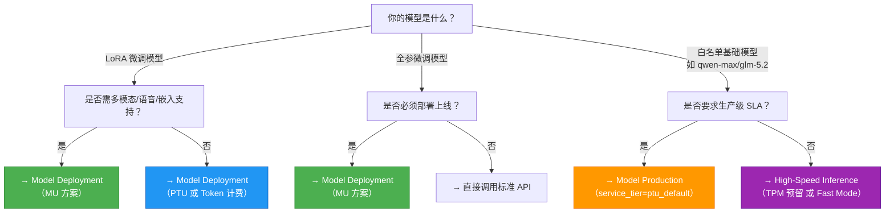

# 模型服务化方案对比：Model Deployment、High-Speed Inference 与 Model Production

## 背景与目的

在百炼平台中，“模型服务化”并非单一能力，而是覆盖**模型上线全生命周期**的三类技术路径：  
- **Model Deployment**（模型部署）聚焦于将模型（含基础模型、LoRA/全参微调模型）转化为**独立、资源专享的推理服务实例**，强调部署灵活性、模型兼容性与成本可控性；  
- **High-Speed Inference**（高性能推理）面向已上线服务的**性能增强层**，通过 TPM 预留保障吞吐稳定性、通过 Fast Mode 优化单请求响应速度，不改变服务拓扑，属“无感加速”；  
- **Model Production**（模型生产化）是 Model Deployment 的**高 SLA 子集**，特指基于 TPM 预留机制的、面向核心业务的**容量确定性部署方案**，强调可预测性、强隔离性与企业级运维能力。

本对比旨在帮助开发者清晰区分三者定位、能力边界与适用条件，避免因概念混淆导致选型偏差（如误用 LoRA 模型申请 TPM 预留，或在低延迟场景下忽略 Fast Mode），从而高效构建稳定、高性能、可演进的 AI 服务架构。

---

## 关键维度对比表

| 维度 | Model Deployment（文档 1） | High-Speed Inference（文档 2） | Model Production（文档 3） |
|------|-----------------------------|----------------------------------|-----------------------------|
| **本质定位** | 模型服务化入口：创建独立推理端点 | 性能增强中间件：叠加于已有 API 的加速能力 | 生产级部署范式：TPM 预留驱动的确定性服务形态 |
| **输入格式** | 支持完整 OpenAI 兼容请求体（`messages`, `stream`, `max_tokens`, `temperature` 等）；PTU/MU 支持 `enable_thinking`、`max_context_length` 等扩展参数 | 同标准 API 格式；Fast Mode 需额外解析 `delta.reasoning_content`；TPM 预留无格式变更 | 完全兼容 OpenAI 标准；支持 `thinking_output_tpm` 配额控制；流式需显式加 `X-DashScope-SSE: enable` |
| **输出格式** | 标准 JSON 响应（含 `id`, `choices`, `usage`）；PTU 溢出时返回 `x-dashscope-ptu-overflow:true` 响应头 | 同标准格式；Fast Mode 中 `reasoning_content` 在流式响应中独立推送；TPM 预留无格式变化 | 同标准格式；`usage` 字段精确拆分 `input_tokens`, `output_tokens`, `thinking_tokens`（若启用思考模式） |
| **支持模型** | • PTU：部分预置模型 + 所有 LoRA 模型 • MU：全部预置模型 + 所有 LoRA/全参微调模型 + 多模态/语音/嵌入模型 • [Token](../concepts/token.md) 计费：**仅 LoRA 微调模型**（严格校验 rank/词表/ViT 冻结） | • TPM 预留：9 款白名单模型（`qwen-max`, `glm-5.2`, `deepseek-v4-pro` 等） • Fast Mode：仅 `*-fast-preview` 变体（如 `glm-5.2-fast-preview`），非所有模型均提供 | **仅限 9 款白名单基础模型**（`qwen-max`, `qwen-plus-2026-05-26`, `glm-5.1`, `kimi-k2.6` 等）；**不支持任何微调模型（LoRA/全参）** |
| **API 端点** | • 控制台生成专属 endpoint（如 `https://dashscope.aliyuncs.com/api/v1/services/aigc/text-generation`） • MU/PTU 部署后使用统一域名 | • TPM 预留：复用标准域名 `dashscope.aliyuncs.com`，仅 `model` 参数替换为专属 code • Fast Mode：**必须使用专用域名** `https://{workspace_id}.{region}.maas.aliyuncs.com/compatible-mode/v1` | • 必须使用 workspace-dedicated 域名 `https://{workspace_id}.{region}.maas.aliyuncs.com/compatible-mode/v1` • 接口路径为 `/api/v1/deployments/{deployed_model}/chat/completions` |
| **计费方式** | • PTU：预付费/后付费（按 kTPM 容量包） • MU：按算力单元（MU）+ 副本数计费（后付/包月） • [Token](../concepts/token.md) 计费：按实际 token 使用量（无容量保障） | • TPM 预留：“按天”预付费（自然日结算） • Fast Mode：**按 token 使用量计费**（单价同标准 API，无额外费用） | • 仅支持 `pre_paid`（预付费）或 `post_paid`（后付费） • 计费粒度为 kTPM 容量（`input_tpm`/`output_tpm`/`thinking_output_tpm`） |
| **资源隔离性** | • PTU/MU：**物理/逻辑资源专享**（独占 GPU 实例或调度队列） • [Token](../concepts/token.md) 计费：共享公共资源池 | • TPM 预留：**专属容量隔离**（不受公共池限流影响） • Fast Mode：**逻辑队列隔离**（排队机制，不参与公共限流） | **强资源隔离**：专属计算资源 + 独立流量通道 + SLA 保障（99.9% 可用性承诺） |
| **扩缩容能力** | • PTU/MU：控制台/API 自助扩缩容（实时生效） • Token 计费：**需人工审核扩容** | • TPM 预留：支持 API 动态调整 `ptu_capacity`（异步生效） • Fast Mode：**无扩缩容概念**（自动负载均衡） | **支持 API 扩缩容**（`PUT /scale`），但要求 `input_tpm`/`output_tpm`/`thinking_output_tpm` 同向调整；预付费扩缩容为异步状态机 |
| **典型场景** | • 快速验证自定义 LoRA 模型效果 • 多模态/语音/嵌入等非文本模型上线 • 成本敏感型 PoC 或 A/B 测试 | • 高并发客服机器人（TPM 预留防抖） • 编程助手实时补全（Fast Mode 降低首 Token 延迟） • Agent 多步推理链路提速 | • 金融风控实时决策引擎 • 电商大促期间搜索推荐服务 • 企业知识库 SaaS 核心 API（需合同级 SLA） |

---

## 适用场景建议

### ✅ 推荐选择 **Model Deployment**
- 你需要部署 **LoRA 微调模型** 或 **全参微调模型**；
- 你需要支持 **多模态（Qwen-VL）、语音合成（CosyVoice）、嵌入/重排序模型**；
- 你处于 **快速迭代期**，需频繁扩缩容、切换模型版本或测试不同推理参数（如 `max_context_length`, `enable_thinking`）；
- 你的预算有限，希望采用 **按 Token 使用量** 的弹性计费模式（注意：仅限 LoRA 模型）。

### ✅ 推荐选择 **High-Speed Inference**
- 你已通过标准 API 或 Model Deployment 上线服务，但面临 **高峰期限流（429）或首 Token 延迟过高**；
- 你使用的是 **白名单中的基础模型**（如 `glm-5.2`, `qwen-max`），且对 **吞吐稳定性（TPM 预留）或单请求速度（Fast Mode）** 有明确提升诉求；
- 你希望 **零代码改造** 即获得性能提升（TPM 预留只需换 `model` 参数；Fast Mode 只需切域名）；
- 你接受 **preview 阶段能力**（Fast Mode 功能与模型列表可能调整）。

### ✅ 推荐选择 **Model Production**
- 你的服务是 **核心生产系统**，SLA 要求 ≥99.9%，且需合同级容量保障；
- 你使用的是 **文档明确列出的 9 款白名单基础模型**，且**无需微调**（或微调后仅用于离线分析，不直接部署）；
- 你需要 **精细化的 TPM 配额管理**（如为思考阶段单独分配 `thinking_output_tpm`）；
- 你的运维流程要求 **API 驱动的全生命周期管理**（创建、扩缩容、续订、溢出策略动态切换）；
- 你已具备 **区域绑定的 API Key** 和 **workspace-dedicated 域名接入能力**。

### ⚠️ 明确不适用场景（避坑指南）
- **不要用 Model Production 部署 LoRA 模型**：即使 LoRA 模型已在控制台可见，其 `model_name` 不在 TPM 白名单内，API 创建必报 `404 ModelNotFound`；
- **不要对 Fast Mode 启用 TPM 预留**：二者当前互斥，`glm-5.2-fast-preview` 不支持 TPM 预留 capacity；
- **不要在 Token 计费模式下期待低延迟**：该模式无资源保障，高峰时段延迟波动大，不适用于交互式应用；
- **不要跨地域混用 API Key**：Model Production 与 High-Speed Inference 的 API Key 均强绑定 `cn-beijing` 或 `ap-southeast-1`，跨区调用必然失败。

---

## 技术选型参考（给开发者的决策树）

> **关键提示**：  
> - 若同时需要 **微调模型上线** + **高吞吐保障**，应组合使用：先用 **Model Deployment（MU）** 部署 LoRA 模型，再为其配置 **High-Speed Inference（TPM 预留）** —— 注意：此时 TPM 预留作用于 MU 部署生成的专属 endpoint，而非标准 API。  
> - 所有方案均需提前完成 **OSS 模型导入**（LoRA）、**工作空间权限授权**（`deployment privilege`）及 **API Key 区域绑定**，缺失任一环节将导致部署失败。  
> - 生产环境强烈建议开启 **溢出策略监控**（`x-dashscope-ptu-overflow:true` 响应头）与 **TPM 使用率告警**，避免容量瓶颈引发业务降级。

---  
*最后更新：2025年7月*

## 被对比主题页

- [model deployment 1](../guides/model-deployment-1.md)
- [model high speed inference](../guides/model-high-speed-inference.md)
- [model production](../api/model-production.md)

