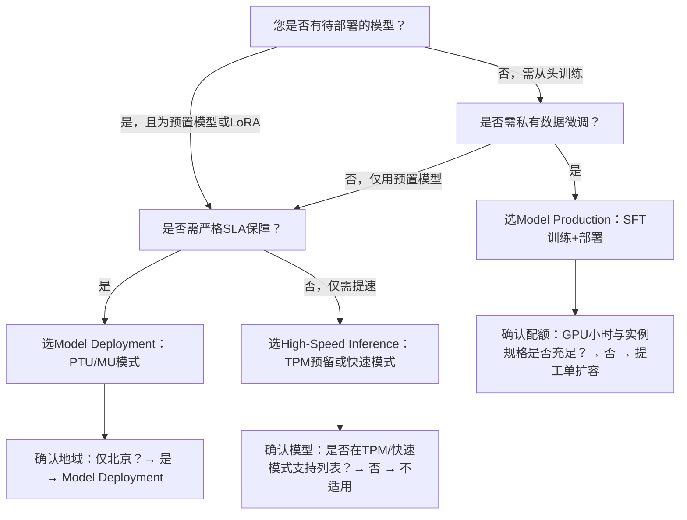

# [模型部署](../concepts/model-deployment.md)方式对比：Model Deployment、High-Speed Inference 与 Model Production

## 背景与目的  
在百炼平台中，开发者面临多种模型服务化路径，但不同能力定位差异显著：  
- **Model Deployment**（[模型部署](../concepts/model-deployment.md)）聚焦于**已训练/微调完成模型的生产级服务化**，强调资源隔离、性能保障与灵活计费；  
- **High-Speed Inference**（高性能推理）面向**已有标准模型服务的吞吐与延迟优化**，提供容量预留与加速模式两类“增强型调用”能力，不涉及模型变更或服务创建；  
- **Model Production**（模型生产）则覆盖**从基础模型出发的端到端定制闭环**，包含微调训练、版本管理、弹性部署及灰度发布等全生命周期能力。  

本对比旨在帮助开发者根据实际需求（如是否需训练、是否已有模型、SLA要求、成本敏感度等）快速识别最适配的技术路径，避免能力误用或架构冗余。

---

## 关键维度对比表

| 维度 | Model Deployment | High-Speed Inference | Model Production |
|------|------------------|----------------------|------------------|
| **核心定位** | 将**已有模型（预置或LoRA）部署为专属推理服务** | 对**标准API调用链路进行性能增强**（不创建新服务） | **从零构建可交付模型资产**：微调 → 验证 → 部署 → 运维 |
| **输入格式** | - 预置模型名称（如 `qwen3-8b`） - LoRA模型OSS路径（需满足rank/冻结约束） | - TPM预留：标准模型ID + 预留容量参数 - 快速模式：固定模型ID `glm-5.2-fast-preview` + 专属域名 | - 训练数据集URI（JSONL格式） - 基础模型ID（如 `qwen2-7b-chat`） - 微调超参（learning_rate, epochs等） |
| **输出格式** | 标准OpenAI/DashScope兼容响应（含`usage`字段），支持流式 | 同标准API响应格式；快速模式额外返回`delta.reasoning_content`字段 | 微调任务产出`model_id`；部署后生成独立`deployment_id`及专属调用Endpoint |
| **支持模型类型** | - 预置模型：Qwen/GLM/DeepSeek/Kimi/CosyVoice等全量支持 - 自定义模型：**仅LoRA微调模型**（全参微调不支持） | - TPM预留：主流预置模型（Qwen/GLM/DeepSeek/Kimi等） - 快速模式：**仅`glm-5.2-fast-preview`**（Preview阶段） | - 基础模型：百炼托管的Qwen系列等（支持SFT） - 自定义模型：支持导入第三方模型（需符合格式规范） |
| **API端点** | `/v1/chat/completions`（使用部署生成的`model` ID） | - TPM预留：同标准API，仅`model`字段替换为预留code - 快速模式：**专属域名** `https://{workspace_id}.{region}.maas.aliyuncs.com/compatible-mode/v1` | - 微调：`/v1/fine_tuning_jobs` - 部署：`/v1/deployments` - 推理：`/v1/deployments/{id}/chat/completions` |
| **计费方式** | 三模式可选： - **PTU**：预付费吞吐额度（按输入/输出TPM购买） - **MU**：预付费计算单元（按MU规格+副本数） - **LoRA [Token](../concepts/token.md)计费**：按实际[Token](../concepts/token.md)用量计费（仅限SFT LoRA） | - **TPM预留**：预付费（按天结算，缩容退订有违约金） - **快速模式**：按[Token](../concepts/token.md)用量计费（输入/输出单价固定，**无缓存折扣**） | - 微调：按GPU小时计费 - 部署：按实例规格（如`gpu.g1.2xlarge`）+ 副本数 + 运行时长计费 |
| **典型场景** | - 高并发客服机器人（PTU保障TPS） - 需PD分离降低首Token延迟的Agent（MU模式） - 成本敏感的LoRA验证服务（Token计费） | - 大促期间保障核心推荐模型吞吐（TPM预留） - 实时对话应用追求极致首Token延迟（快速模式） | - 基于私域数据定制行业知识模型（如金融问答、医疗摘要） - 需要AB测试、灰度发布、一键回滚的生产环境 |
| **地域支持** | 仅华北2（北京） | TPM预留：华北2（北京）、新加坡 快速模式：华北2（北京）、新加坡 | 全地域（以控制台可用区为准） |
| **运维能力** | - 基础监控（额度消耗、缓存命中率） - 无灰度/回滚能力 | - 无独立监控面板 - TPM预留提供容量水位告警 | - 完整可观测性（日志、指标、Trace） - 流量灰度、版本回滚、弹性扩缩容 |

---

## 适用场景建议

### ✅ 选择 **Model Deployment** 当：
- 您已拥有**训练完成的LoRA模型**（如通过百炼或外部工具微调），需快速上线为稳定服务；
- 您使用**百炼预置模型**，且对延迟、吞吐或成本有明确SLA要求（如PTU保底、MU定制推理模式）；
- 场景轻量、无需频繁迭代模型版本，侧重**开箱即用的服务化**。

### ✅ 选择 **High-Speed Inference** 当：
- 您正在使用**标准百炼API**，但业务高峰期出现超时或排队，需**不改代码提升稳定性**（TPM预留）；
- 您的应用对**首Token延迟极度敏感**（如实时语音转写、交互式编程助手），且可接受Preview模型限制（快速模式）；
- 您**不希望管理服务生命周期**，仅需在现有调用链路上叠加性能保障。

### ✅ 选择 **Model Production** 当：
- 您需要**基于自有数据训练专属模型**（如企业知识库问答、垂直领域摘要）；
- 您要求**生产环境级治理能力**：多版本管理、灰度发布、故障快速回滚、细粒度资源监控；
- 您的流程涉及**模型持续迭代**（训练→评估→部署→反馈→再训练），需统一平台支撑。

> ⚠️ 注意：三者非互斥，而是分层协作关系。典型组合路径：  
> **Model Production**（微调生成`qwen3-ft-financial`） → **Model Deployment**（部署为MU模式服务） → **High-Speed Inference**（为该服务申请TPM预留应对流量高峰）

---

## 技术选型决策树（面向开发者）

**关键检查清单**：  
- 若使用LoRA：Model Deployment是唯一支持路径（Model Production不支持LoRA直接部署，High-Speed Inference不涉及模型导入）；  
- 若需微调：Model Production是必经之路，其产出模型可后续通过Model Deployment进一步优化部署形态；  
- 若已上线标准API但遭遇性能瓶颈：优先评估High-Speed Inference，避免重构服务架构；  
- 所有方案均需确保API Key具备对应权限（如OSS读取、[模型部署](../concepts/model-deployment.md)授权、微调作业权限）。

## 被对比主题页

- [model deployment 1](../guides/model-deployment-1.md)
- [model high speed inference](../guides/model-high-speed-inference.md)
- [model production](../api/model-production.md)

