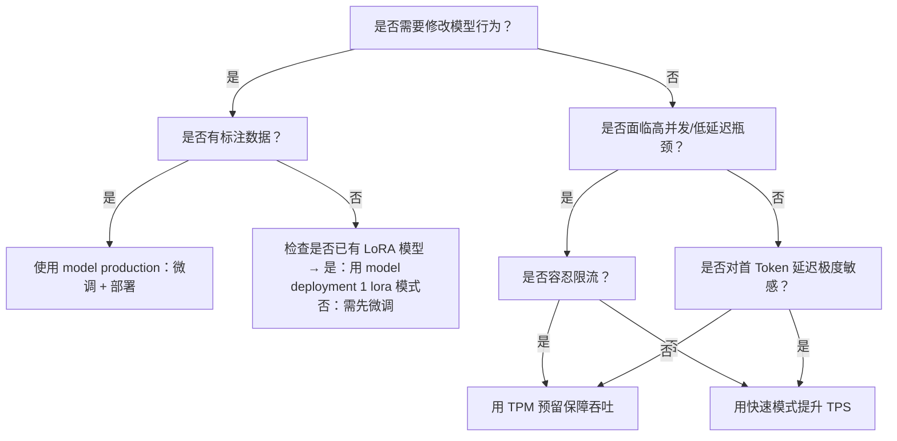

# [模型部署](../concepts/model-deployment.md)方式对比：高并发推理、[模型部署](../concepts/model-deployment.md)1与模型生产

## 背景与目的  
在百炼平台中，“高并发推理”“[模型部署](../concepts/model-deployment.md)1”和“模型生产”三类能力常被开发者混淆，但其定位、适用阶段与技术边界存在本质差异：  
- **高并发推理**（Model High Speed Inference）聚焦于**已有模型的性能增强**，解决 *调用稳定性* 与 *响应速度* 的 SLA 保障问题，不涉及模型变更；  
- **模型部署1**（Model Deployment 1）面向**已确定模型的生产化服务交付**，提供资源独占、可定制、可监控的专属推理服务，支持预置模型与 LoRA 微调模型；  
- **模型生产**（Model Production）覆盖**从训练到上线的端到端模型生命周期**，核心是 *微调训练 + 部署发布*，适用于需要定制模型行为（如领域适配、指令对齐）的场景。  

本文旨在为开发者提供清晰、可落地的技术选型参考，避免因能力错配导致资源浪费、延迟超标或功能不可达。

---

## 关键维度对比表

| 维度 | 高并发推理（High Speed Inference） | 模型部署1（Model Deployment 1） | 模型生产（Model Production） |
|------|-----------------------------------|----------------------------------|------------------------------|
| **核心目标** | 提升现有模型 API 的吞吐量保障性与首 [Token](../concepts/token.md) 延迟 | 将指定模型（预置/LoRA）部署为资源独占、SLA 可控的专属服务 | 完成模型微调训练并发布为可调用服务，实现“训练即部署”闭环 |
| **输入格式** | 标准 OpenAI/DashScope 推理请求（`messages`, `model`, `max_tokens` 等） | 同上；LoRA 部署需先完成 OSS 导入校验 | 微调阶段：JSONL 标注数据（`{"messages": [...]}`）；部署阶段：微调任务 ID 或合并后模型 ID |
| **输出格式** | 标准 Chat Completion 响应（含 `choices[0].message.content`、`usage` 等） | 同上；MU 模式额外支持 `reasoning_content` 流式字段 | 同上；微调任务返回 `fine_tuned_model_id`，部署后生成独立 `deployment_name` 作为 model identifier |
| **支持模型** | ✅ 千问、GLM、DeepSeek、Kimi 等主流预置模型（TPM 预留） ✅ 仅 `glm-5.2-fast-preview`（快速模式） | ✅ 全系列预置模型（Qwen3-Max/Plus/Flash/VL/Omni、DeepSeek-v3/v4、GLM-5.x、Kimi-K2.5 等） ✅ LoRA 微调模型（OSS 导入，rank=8/16/32/64，chat_template 未修改） | ✅ 百炼官方托管基础模型（Qwen、Baichuan 系列等） ❌ 不支持自定义架构或 PyTorch 模型直接上传 ❌ 不支持 LoRA adapter 独立部署（必须合并权重） |
| **API 端点** | • TPM 预留：`https://dashscope.aliyuncs.com/api/v1/services/aigc/text-generation/generation`（复用标准 endpoint） • 快速模式：`https://{workspace_id}.cn-beijing.maas.aliyuncs.com/compatible-mode/v1/chat/completions`（专属域名） | `https://dashscope.aliyuncs.com/api/v1/deployments`（创建） 推理调用：`https://dashscope.aliyuncs.com/api/v1/chat/completions`（`model` 字段填部署服务 ID） | • 微调：`POST https://dashscope.aliyuncs.com/api/v1/fine_tuning/jobs` • 部署：`POST https://dashscope.aliyuncs.com/api/v1/deployments` • 推理：`POST https://dashscope.aliyuncs.com/api/v1/chat/completions`（`model` 填 `deployment_name`） |
| **计费方式** | • TPM 预留：按自然日预付费（kTPM/天），支持溢出转按量 • 快速模式：纯按 token 实时计费（4 元/百万 token），无预付费周期 | • PTU 模式：预付费（kTPM/天），支持溢出转按量 • MU 模式：按模型单元（MU）规格+时长计费（如 MU1/小时） • LoRA 模式：纯按 token 计费（无预付费） | • 微调训练：按 GPU 小时计费（依模型规模与 epoch 自动匹配卡型） • 部署服务：按 token 实时计费（同标准 API），**无预付费资源占用成本** |
| **典型场景** | • 大流量客服机器人（需抗峰值限流） • AI 编程助手（敏感于首 [Token](../concepts/token.md) 延迟） • Agent 多步链式调用（要求低 P99 延迟） | • 企业级知识库问答服务（需长上下文+前缀缓存） • 金融风控模型 API（需 PD 分离降低首 [Token](../concepts/token.md) 延迟） • LoRA 微调后的垂类模型在线服务（如法律合同解析） | • 将通用大模型适配至医疗问答场景（SFT 微调 + 发布） • 构建品牌专属客服模型（基于历史对话数据微调） • 快速验证新 [prompt](../guides/prompt.md) 或 instruction 效果（小样本微调 + A/B 测试） |
| **资源隔离性** | • TPM 预留：逻辑容量隔离（共享物理资源，但有吞吐保障） • 快速模式：物理调度优化（专属流水线），但非资源独占 | ✅ 物理资源独占（PTU/MU 模式）或计算资源绑定（LoRA 模式） | ❌ 微调训练：共享训练集群（非独占） ✅ 部署服务：资源独占（底层为专属实例） |
| **冷启动延迟** | 无冷启动（复用现有模型服务） | • PTU/MU：秒级就绪（预热后） • LoRA：首次调用约 5–10 秒（加载 adapter） | ⚠️ 显著：部署服务首次调用需 30–60 秒（模型加载+初始化） |
| **生命周期管理** | • TPM 预留：自然日计费，到期后 2 小时内仍可用，14 小时后彻底删除 • 快速模式：无生命周期，按 token 实时结算 | • PTU/MU：预付费订单到期后延后 2 小时停服，资源保留 14 小时 • LoRA：服务持续运行，按 token 计费 | • 微调任务：成功后模型长期保留（需手动清理失败任务临时模型） • 部署服务：持续运行，无自动过期机制 |

---

## 适用场景建议（面向开发者）

### ✅ 选择「高并发推理」当：
- 你已使用标准 API，但遭遇高峰期限流（HTTP 429）或首 Token 延迟超标；
- 业务 SLA 要求明确：例如“P99 延迟 ≤ 800ms” 或 “峰值 QPS ≥ 500 且零限流”；
- **无需修改模型本身**，仅需提升调用体验（如 Agent 编排、实时交互应用）；
- 注意：快速模式仅限 `glm-5.2-fast-preview`，且不支持 TPM 预留组合。

### ✅ 选择「模型部署1」当：
- 你需要将**某个确定版本的模型**（无论是千问 Flash 还是自己微调的 LoRA）长期、稳定、可控地对外提供服务；
- 场景要求深度定制：如设置 RPM/TPM 限流、启用 Thinking 模式、配置 200K 上下文、开启前缀缓存；
- 对资源隔离性有硬性要求（如金融、政务类系统需规避多租户干扰）；
- 注意：LoRA 模型只能走 `lora` 计费模式，不支持 PTU/MU；新加坡地域 LoRA 部署需通过控制台操作。

### ✅ 选择「模型生产」当：
- 你的目标是**让模型具备新能力**（如理解行业术语、遵循特定回复格式），而非仅优化调用性能；
- 你拥有标注数据，并希望以最小工程成本完成“训练 → 验证 → 上线”闭环；
- 需要版本化管理：例如保留 v1（通用版）、v2（医疗版）、v3（法务版）多个微调模型；
- 注意：微调后模型必须合并权重才能部署，无法以 LoRA adapter 形式轻量发布；冷启动延迟需纳入业务设计。

### ⚠️ 避免误用的典型情形：
- 为 `glm-5.2-fast-preview` 创建 TPM 预留 → **不支持，二者正交互斥**；  
- 用 `model production` 部署一个未经微调的千问模型 → **冗余，应直接用 `model deployment 1` 或标准 API**；  
- 在 `model deployment 1` 中尝试部署全参微调模型 → **不支持，仅接受 LoRA**；  
- 期望 `model production` 提供 TPM 容量保障 → **不提供，需搭配 `model deployment 1` 的 PTU 模式使用**。

---

## 技术选型决策树（简版）

> 💡 **终极建议**：  
> - **性能优化优先级**：先评估是否可通过 Prompt 工程、RAG 或缓存优化缓解，再考虑高并发推理；  
> - **生产服务基线**：所有对外交付的模型服务，强烈推荐通过 `model deployment 1` 部署，以获得监控、扩缩容与 SLA 保障；  
> - **模型演进路径**：`model production`（训练）→ `model deployment 1`（发布）→ `high speed inference`（加速），三者可组合使用，但不可替代。

## 被对比主题页

- [model high speed inference](../guides/model-high-speed-inference.md)
- [model deployment 1](../guides/model-deployment-1.md)
- [model production](../api/model-production.md)

