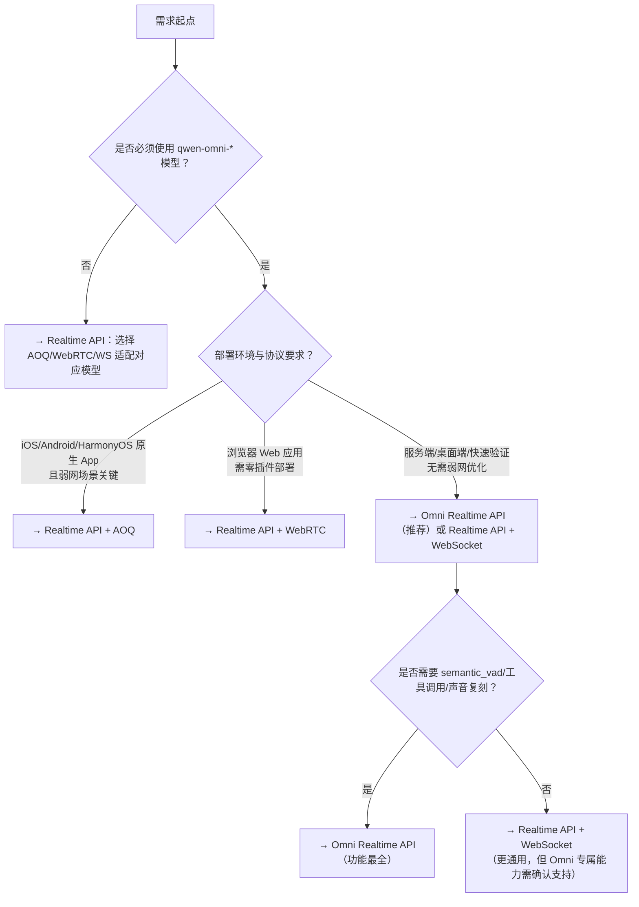

# 实时 API 方案对比：Omni Realtime API vs Realtime API

本文旨在帮助开发者清晰区分百炼平台两大实时交互能力——**Omni Realtime API** 与 **Realtime API（广义协议栈）**，明确其定位差异、能力边界与适用约束。二者虽均面向低延迟[多模态](../concepts/multi-modal.md)交互场景，但设计哲学、架构层级与使用范式存在本质区别：  
- **Omni Realtime API** 是一个**具体、统一的 WebSocket 接口规范**，聚焦于 `qwen-omni-*` 系列模型的端到端实时对话能力，强调事件驱动、细粒度流控与语音/文本/图像协同；  
- **Realtime API** 是一个**协议抽象层与接入框架**，提供 AOQ、WebRTC、WebSocket 三种传输通道，支持更广泛的模型类型（含 Omni 全模态、ASR、TTS、翻译等），强调跨平台兼容性、弱网鲁棒性与媒体栈可定制性。  

正确理解二者关系是技术选型的前提：**Omni Realtime API 是 Realtime API 协议体系下、专为 Omni 模型优化的 WebSocket 实现子集；而 Realtime API 本身不限于 Omni 模型，也不限于 WebSocket 协议。**

---

## 关键维度对比

| 维度 | Omni Realtime API | Realtime API（广义协议栈） |
|------|-------------------|-----------------------------|
| **本质定位** | 面向 `qwen-omni-*` 模型的**标准化 WebSocket 接口规范**（单一协议、固定事件模型） | **多协议实时通信框架**，包含 AOQ（移动端原生）、WebRTC（浏览器/跨平台）、WebSocket（服务端/原型）三套接入路径 |
| **输入格式** | - PCM 音频（16 kHz，单声道） - JPG/JPEG 图像（≤1080p，Base64 编码 ≤256 KB） - 文本（通过 `session.update` 或 `input_text` 事件） | - PCM 音频（16 kHz） - 视频帧（I420/NV12/BGRA/JPEG，AOQ/WebRTC 支持） - 文本（各协议均支持） - *不支持图像输入（除 Omni 模型在 WebSocket 路径下）* |
| **输出格式** | - `["text"]` 或 `["text","audio"]`（音频为 24 kHz PCM） - 严格按事件流推送：`response.text.delta`、`response.audio.delta`、`response.audio_transcript.delta` 等 | - 输出模态由 `modalities` 决定（如 `["text","audio"]`） - 协议决定交付形式：  ✓ AOQ/WebRTC：音频/文本混合流（含同步时间戳）  ✓ WebSocket：纯事件流（类似 Omni） |
| **支持模型** | **仅限 `qwen-omni-*` 系列**： - `qwen3.5-omni-realtime`（plus/flash） - `qwen3-omni-flash-realtime` - `qwen-omni-turbo-realtime` | **全模型谱系支持**： - ✅ Omni 全模态模型（三协议均支持） - ✅ 实时语音识别（Fun-ASR，仅 WebSocket） - ✅ 实时语音合成（CosyVoice，仅 WebSocket） - ✅ 实时语音对话（qwen-audio-3.0，仅 WebSocket） - ✅ [多模态](../concepts/multi-modal.md)开发套件（multimodal-dialog，仅 WebRTC/WebSocket） - ❌ 不支持非实时模型（如 standard Qwen3） |
| **API 端点** | 固定 WebSocket 地址： `wss://{WorkspaceId}.cn-beijing.maas.aliyuncs.com/api-ws/v1/realtime` （需替换 `{WorkspaceId}`） | **协议差异化端点**： - AOQ：通过网关获取 Relay 接入点（`relayEndpoints`）+ `aoqTokenForClient` - WebRTC：信令服务器地址 + SDP 交换流程 - WebSocket：同 Omni 端点（但鉴权方式不同） |
| **计费方式** | 按 **实际调用时长（秒） + 输出 token 数 + 输出音频时长（秒）** 分项计费 （Omni 模型专属计费模型，含 VAD、工具调用等附加能力） | 按 **所选模型 + 协议 + 使用资源** 计费： - Omni 模型：同 Omni Realtime API 计费规则 - Fun-ASR/CosyVoice：按音频处理时长（秒）计费 - multimodal-dialog：按会话时长 + 调用次数计费 ※ 各协议无额外传输费用 |
| **典型场景** | - 高互动性语音助手（需语义 VAD、主动引导、工具调用） - 智能客服坐席系统（需音色复刻、多轮上下文保持） - 实时[多模态](../concepts/multi-modal.md)教育交互（图文+语音同步反馈） | - 移动端弱网环境语音助手（AOQ 提供 3A 与抗丢包） - 浏览器内嵌实时翻译/会议字幕（WebRTC 原生支持） - 后端服务集成 ASR/TTS 流水线（WebSocket 快速对接） - 多模态对话原型验证（WebSocket 低成本启动） |
| **核心优势** | - 事件语义清晰（`input_audio_buffer.append` / `response.audio.delta`） - 完整支持 Omni 专属能力（semantic VAD、工具调用、声音复刻、`idle_timeout_ms`） - SDK 封装成熟（Python/JS/Java），开箱即用 | - **协议灵活性**：AOQ（移动端极致体验）、WebRTC（浏览器零依赖）、WebSocket（通用轻量） - **模型泛化性**：一套框架接入全实时模型族 - **媒体栈可控性**：AOQ/WebRTC 支持自定义采集/渲染/编解码 |
| **主要限制** | - 仅支持 WebSocket 协议，无 AOQ/WebRTC 能力 - 仅限 Omni 模型，无法接入 ASR/TTS 等专项模型 - `turbo` 模型参数不可调，灵活性受限 | - AOQ 不支持浏览器、不支持非 Omni 模型（如 Fun-ASR） - WebRTC 在非浏览器环境需第三方库支持 - WebSocket 缺乏弱网优化与内置 3A，需自行实现 |

---

## 适用场景建议

### 选择 Omni Realtime API 当：
- ✅ 业务明确使用 `qwen-omni-*` 系列模型（如需语音+图像理解、文本+音频同步生成）；  
- ✅ 开发目标为 **服务端集成或 Web/桌面端应用**，且对弱网适应性要求不高；  
- ✅ 需要快速落地 **语义级语音活动检测（semantic_vad）、工具[函数调用](../concepts/function-calling.md)、声音复刻、静默主动引导** 等高级能力；  
- ✅ 团队熟悉 WebSocket 事件编程模型，倾向使用 DashScope 官方 Python/JS SDK 快速构建。

### 选择 Realtime API（广义）当：
- ✅ 需要 **跨平台深度适配**：iOS/Android/HarmonyOS 原生 App → 选 **AOQ**；浏览器 Web 应用 → 选 **WebRTC**；后端微服务 → 选 **WebSocket**；  
- ✅ 业务涉及 **多种实时模型组合**：例如前端用 Omni 对话 + 后端调用 Fun-ASR 做离线转写 → 必须通过 Realtime API 的协议分发能力协调；  
- ✅ 对 **弱网稳定性、回声消除、自动增益、低延迟抖动控制** 有硬性要求 → **AOQ 是唯一选择**；  
- ✅ 需要 **完全掌控音视频链路**：如接入自研麦克风硬件、定制视频美颜滤镜、对接专业播放器 → AOQ/WebRTC 提供 `ExternalStream` 接口。

> ⚠️ 注意：若仅使用 Omni 模型且运行在浏览器或服务端，**Omni Realtime API 与 Realtime API 的 WebSocket 路径功能高度重叠**，此时优先选用 Omni Realtime API（语义更精准、文档更聚焦、SDK 更专用）；若需 AOQ 或 WebRTC 能力，则必须走 Realtime API 框架。

---

## 技术选型决策树（面向开发者）

**最后建议**：  
- 新项目优先评估 **Omni Realtime API** —— 它是 Omni 模型能力的“黄金标准”实现，文档完备、SDK 稳健、事件语义直观；  
- 若项目已存在 AOQ/WebRTC 基础设施，或需混合接入 ASR/TTS 等模型，请直接采用 **Realtime API 框架**，并依据终端类型选择协议；  
- 永远避免将 API Key 硬编码于客户端；AOQ 必须经服务端签发临时 [Token](../concepts/token.md)，WebSocket/WebRTC 建议同样通过后端代理鉴权。

## 被对比主题页

- [omni realtime api](../api/omni-realtime-api.md)
- [realtime api user guide](../api/realtime-api-user-guide.md)

