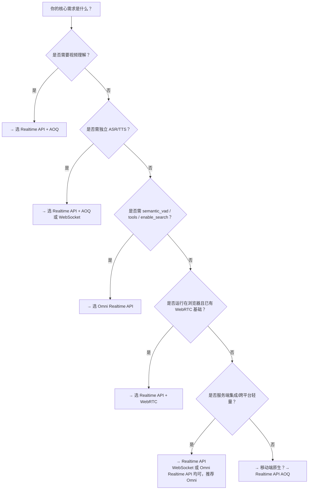

# 实时 API 方案对比：Realtime API vs Omni Realtime API

本文旨在帮助开发者在百炼平台中快速理解并选择最适合业务需求的实时交互方案。随着语音助手、智能客服、多模态对话等场景对低延迟、高可靠性、灵活扩展性的要求持续提升，百炼平台提供了两类核心实时能力接口：**Realtime API**（通用型多协议实时框架）与 **Omni Realtime API**（聚焦语音助手场景的 WebSocket 原生优化接口）。二者虽共享底层模型（如 `qwen3.5-omni-plus-realtime`），但在协议设计、能力边界、接入复杂度和适用场景上存在显著差异。本页从技术选型视角出发，系统对比关键维度，并提供明确的场景化建议。

## 关键维度对比

| 维度 | Realtime API | Omni Realtime API |
|------|--------------|-------------------|
| **协议支持** | 支持三种传输协议： • AOQ（移动端原生首选，含弱网优化、AEC/降噪集成） • WebRTC（浏览器端原生，依赖 `RTCPeerConnection`） • WebSocket（服务端/跨平台轻量接入） | **仅 WebSocket 协议**（WSS），基于标准 WebSocket 实现，无额外 SDK 依赖（官方提供 Python/Java SDK 封装） |
| **输入格式** | • 音频：固定 `pcm`（16kHz 输入采样率） • 视频/文本：按轨道（track）或 data channel 传输 • 多模态输入需通过 `publishTracks` 显式声明 | • 音频：支持 `pcm` / `wav`，采样率可配（8k/16k/24k/48k） • 文本：通过 `conversation.item.create` 事件提交 • **不支持视频输入**（纯语音+文本交互） |
| **输出格式** | • 文本：`response.text.delta` [流式输出](../concepts/streaming-output.md) • 音频：`response.audio.delta`（PCM，24kHz 固定） • 多模态混合输出由 `modalities` 控制（`["text","audio"]` 或 `["text"]`） | • 文本：`response.text.delta` [流式输出](../concepts/streaming-output.md) • 音频：`response.audio.delta`（PCM/WAV，采样率可配） • **不支持纯音频输出**；必须至少包含 `"text"` 模态 |
| **支持模型** | • 全模态：`qwen3.5-omni-plus-realtime`, `qwen3.5-omni-flash-realtime` • 语音翻译：`qwen3.5-livetranslate-flash-realtime` • ASR/TTS：`Qwen-Audio-3.0-ASR-Flash-Streaming`, `CosyVoice` 等（**AOQ/WebSocket 支持，WebRTC 不支持**） • 多模态套件：`multimodal-dialog` | • 仅支持 Omni 系列模型：  `qwen3.5-omni-plus-realtime`, `qwen3.5-omni-flash-realtime`, `qwen3-omni-flash-realtime`, `qwen-omni-turbo-realtime` • **不支持独立 ASR/TTS 模型**（如 `Fun-ASR-Realtime`、`qwen-audio-3.0-tts-plus`） • `semantic_vad` 和 `enable_search` 仅限 `qwen3.5-omni-*` 系列 |
| **API 端点** | • AOQ：`POST /api/v1/webrtc/realtime`（获取连接凭证） + AOQ Relay 接入点 • WebRTC：`POST /api/v1/webrtc/realtime`（SDP 交换鉴权） • WebSocket：`wss://.../api-ws/v1/realtime`（统一 WebSocket 网关） | • 统一 WSS 端点：  `wss://{WorkspaceId}.cn-beijing.maas.aliyuncs.com/api-ws/v1/realtime` • 所有交互（建连、会话配置、数据收发）均通过该 WebSocket 连接完成 |
| **计费方式** | • 按 **会话时长（秒） + 模型调用次数 + 媒体流带宽** 综合计费 • 不同协议（AOQ/WebRTC/WS）计费策略一致，但 AOQ/Relay 架构可能产生额外中继流量费用 • 工作区级计量，通过 `workspaceIdHash` 路由 | • 按 **会话时长（秒） + 输出 token 数 + 音频处理时长（秒）** 计费 • 语音识别（ASR）结果计入输入 token；TTS 合成计入输出 token • **工具调用（tools）和联网搜索（enable_search）单独计费** |
| **典型场景** | • 移动端音视频会议 SDK 集成（需 AEC/降噪/弱网对抗） • Web 端实时协作白板（WebRTC 原生复用） • 服务端批量语音转写（WebSocket + ASR 模型） • 多模态人机交互原型验证（AOQ + video track） | • 智能语音助手（手机 App 内嵌、车载系统） • 电话客服 IVR 升级（ASR+LLM+TTS 端到端闭环） • 企业知识库语音问答（支持 `enable_search`） • 需要语义级 VAD（`semantic_vad`）的自然对话场景 |
| **VAD 能力** | • 提供 `type: "semantic_vad"`（需配合 Omni 系列模型） • 依赖 `turn_detection` 配置，但协议层无标准化事件语义 | • 原生支持两种 VAD：  `server_vad`（声学检测，通用）  `semantic_vad`（语义级断句，仅 `qwen3.5-omni-*` 支持） • 自动触发 `speech_started`/`speech_stopped` 事件，支持 `idle_timeout_ms` 主动引导 |
| **扩展能力** | • 工具调用（`tools`）：需通过 `session.update` 传入，由模型自主触发 • 联网搜索：暂未开放（文档未提及） | • 工具调用（`tools`）：完整支持，含函数定义、参数校验、调用结果注入 • 联网搜索（`enable_search`）：仅 `qwen3.5-omni-*` 支持，与 `tools` 互斥 • 声音复刻：支持通过 `qwen-voice-enrollment` 创建音色并复用 |
| **接入门槛** | • **高**：需理解协议差异（AOQ/WebRTC/WS）、媒体轨道管理、状态机控制（如 `session.updated` 后才开启推流） • AOQ 需集成 Opus [插件](../concepts/plugin.md)、处理外部音频流缓冲逻辑 • WebRTC 需手动构造 SDP、维护 DataChannel | • **中低**：基于标准 WebSocket，SDK 封装完善（`append_audio()`/`update_session()`/`create_response()` 抽象清晰） • VAD 模式下无需手动 `commit()`，自动分句 • 参数配置集中于 `session.update`，结构化程度高 |

## 各方案适用场景建议

### ✅ 选择 **Realtime API** 当：
- 你的应用是 **原生移动 App（Android/iOS/HarmonyOS）**，且对弱网稳定性、端侧 AEC/降噪、低首包延迟有硬性要求 → **优先选用 AOQ 协议**；
- 你已构建 **WebRTC 基础设施**（如视频会议系统），希望复用现有信令与媒体栈，快速叠加 AI 对话能力 → **选用 WebRTC 协议**；
- 你需要 **独立调用 ASR 或 TTS 模型**（例如：仅做语音转文字存档，或仅合成播报音频）→ **必须使用 AOQ 或 WebSocket 协议**（WebRTC 不支持）；
- 你需要 **视频+语音+文本多模态协同**（如虚拟人直播、AR 教育互动）→ **AOQ 是唯一支持 video track 的协议**；
- 你正在做 **跨平台快速验证**，且不涉及 ASR/TTS → WebSocket 协议可快速跑通全链路。

### ✅ 选择 **Omni Realtime API** 当：
- 你的核心场景是 **语音助手或智能客服对话**，追求自然、流畅、低打断的交互体验 → `semantic_vad` + `idle_timeout_ms` 提供更优对话节奏控制；
- 你需要 **开箱即用的工具调用或联网搜索能力**（如查天气、问百科、执行业务操作）→ Omni API 提供标准化 `tools` 和 `enable_search` 支持；
- 你采用 **服务端主导架构**（如呼叫中心中间件、IoT 网关），希望用统一 WebSocket 接口管理所有实时会话 → 无需协议切换，开发运维更简单；
- 你对 **音频格式灵活性有要求**（如兼容旧设备 8kHz PCM 或高清 48kHz 输出）→ Omni 支持全采样率配置；
- 你希望 **最小化客户端 SDK 体积与依赖**（如嵌入资源受限的嵌入式设备）→ 仅需标准 WebSocket 客户端，无 AOQ/Opus/WebRTC 特定依赖。

### ⚠️ 注意避坑
- **不要在 WebRTC 场景下尝试调用 ASR/TTS 模型**：Realtime API 明确限制 WebRTC 不支持 `Qwen-Audio-3.0-ASR-Flash-Streaming` 等模型，强行调用将返回错误。
- **不要混用 `input_audio_format` 与 `audio.input.format`**：Omni Realtime API 已废弃扁平化字段，新接入必须使用嵌套的 `audio.input.format.type` 和 `audio.input.format.sample_rate`。
- **Realtime API 的 `model` 参数为 URL 查询参数，Omni Realtime API 的 `model` 必须在 `session.update` 中设置**：参数位置不同，易导致建连失败。
- **Omni Realtime API 不支持视频输入**：若业务需摄像头画面理解，请回归 Realtime API 的 AOQ 协议。

## 技术选型决策树（面向开发者）

> 💡 **一句话总结**：  
> **Realtime API 是“能力完备的实时通信操作系统”，适合构建复杂、多协议、多模态的实时应用；**  
> **Omni Realtime API 是“语音助手专用加速器”，在对话体验、扩展能力与接入效率上做了深度优化。**  
> 请根据你的终端形态、协议栈现状、功能需求优先级，而非模型名称，做出理性选型。

## 被对比主题页

- [realtime api user guide](../api/realtime-api-user-guide.md)
- [omni realtime api](../api/omni-realtime-api.md)

